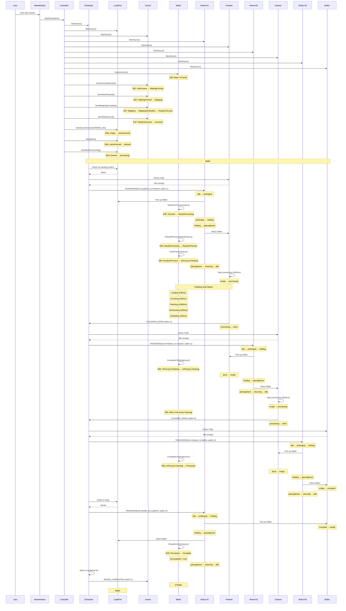

# Single Wafer Process - Sequence Diagram

## Overview
This document shows the complete lifecycle of a single wafer (e.g., Wafer #1) through the CMP (Chemical Mechanical Planarization) system, from carrier arrival to completion.

## Sequence Diagram

## Key States and Transitions

### E90 Substrate (Wafer) States
1. **InCarrier** - Wafer is in the FOUP carrier
2. **NeedsProcessing** - Wafer selected for processing, picked up by R1
3. **ReadyToProcess** - Wafer placed in Polisher, ready to start
4. **InProcess.Polishing** - Wafer being polished (with sub-states)
   - Loading → Chucking → Polishing → Dechucking → Unloading
5. **InProcess.Cleaning** - Wafer being cleaned
6. **Processed** - Wafer processing complete
7. **Complete** - Wafer returned to carrier

### E87 Carrier States
1. **NotPresent** - No carrier at load port
2. **WaitingForHost** - Carrier detected, waiting for host approval
3. **Mapping** - Mapping slot contents
4. **MappingVerification** - Verifying slot map
5. **ReadyToAccess** - Ready for wafer access
6. **InAccess** - Wafers being accessed/processed
7. **Complete** - All wafers processed
8. **CarrierOut** - Carrier removed

### E84 LoadPort States
1. **empty** - No carrier present
2. **carrierArrived** - Carrier arrived at load port
3. **docked** - Carrier docked and secured
4. **processing** - Wafers being processed
5. **unloading** - Carrier being unloaded

### Robot States (R1, R2, R3)
1. **idle** - Robot waiting for command
2. **pickingUp** - Robot picking up wafer
3. **holding** - Robot holding wafer
4. **placingDown** - Robot placing wafer
5. **returning** - Robot returning to idle position

### Station States (Polisher, Cleaner, Buffer)
1. **empty** - No wafer in station
2. **processing** - Processing wafer
3. **done** - Processing complete
4. **occupied** - Station holding wafer (Buffer only)

## Priority Order (Forward Priority Scheduler)

The scheduler processes transfers in this priority order:

1. **P1 (Highest):** Cleaner → Buffer (via R3)
2. **P2:** Polisher → Cleaner (via R2)
3. **P3:** LoadPort → Polisher (via R1)
4. **P4 (Lowest):** Buffer → LoadPort (via R1)

## Timing (Default Configuration)

- **Transfer Time (R1, R2, R3):** 300ms
- **Polishing Time:** 3000ms
  - Loading: 100ms
  - Chucking: 200ms
  - Polishing: 2400ms
  - Dechucking: 200ms
  - Unloading: 100ms
- **Cleaning Time:** 3000ms
- **Total Time per Wafer:** ~7200ms (ideal pipeline)

## Event-Driven Architecture

The system uses **EventBusOrchestrator** (Pub/Sub pattern) for all inter-machine communication:

- Stations report completion → Scheduler
- Scheduler commands robots → Robots
- State machines publish state changes → Controller → UI
- No polling - all updates are event-driven
- Deferred sends ensure proper event ordering

## File References

- **Controller:** `CMPSimulator/Controllers/OrchestratedForwardPriorityController.cs`
- **Scheduler:** `CMPSimulator/StateMachines/DeclarativeSchedulerMachine.cs`
- **Carrier:** `CMPSimulator/StateMachines/CarrierMachine.cs`
- **Wafer:** `CMPSimulator/StateMachines/WaferMachine.cs`
- **LoadPort:** `CMPSimulator/StateMachines/LoadPortMachine.cs`
- **Robots:** `CMPSimulator/StateMachines/RobotMachine.cs`
- **Polisher:** `CMPSimulator/StateMachines/PolisherMachine.cs`
- **Cleaner:** `CMPSimulator/StateMachines/CleanerMachine.cs`
- **Buffer:** `CMPSimulator/StateMachines/BufferMachine.cs`
