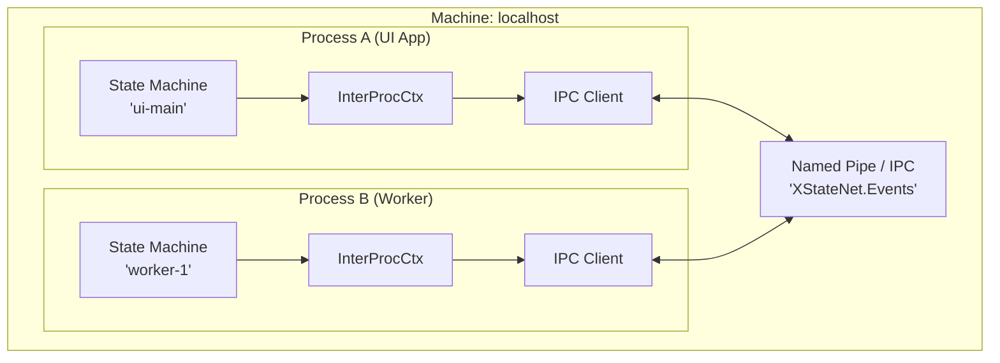
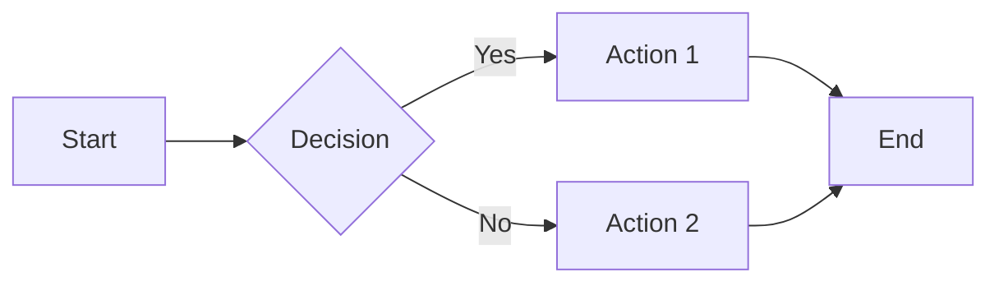
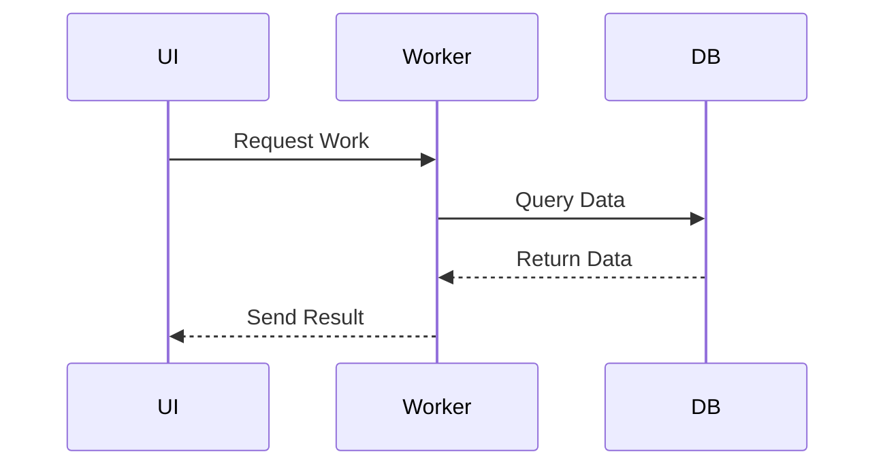

# Diagram Guidelines for XStateNet Documentation

## ✅ Use Mermaid Diagrams Only

**All diagrams in this project must use Mermaid format.** ASCII box diagrams, HTML tables, and other alternatives do not render properly in this environment.

## 📦 Setup

Install the Mermaid extension for VS Code:
- Extension: "Markdown Preview Mermaid Support"
- Or search for "Mermaid" in VS Code extensions

## 📝 Mermaid Diagram Examples

### Example 1: Architecture Diagram

### Example 2: Flow Diagram

### Example 3: Sequence Diagram

## 🚫 What NOT to Use

❌ **ASCII Box Diagrams** - Font-dependent, breaks alignment
❌ **HTML Tables** - Not supported in all viewers
❌ **Simple Text Diagrams** - Poor readability
❌ **Pre-rendered Images** - Hard to maintain, no version control

## 📚 Mermaid Resources

- [Mermaid Documentation](https://mermaid.js.org/)
- [Mermaid Live Editor](https://mermaid.live/)
- [Graph Types](https://mermaid.js.org/intro/syntax-reference.html)

## ✏️ Migration Status

All ASCII diagrams have been converted to Mermaid format in:
- ✅ INTERPROCESS_ORCHESTRATED_PATTERN.md
- ✅ TESTING_INTERPROCESS_GUIDE.md
