# 🔗 InterProcess Orchestrated Pattern Guide

## 📋 Overview

The **InterProcess** transport enables state machines to communicate **across process boundaries on the same machine** using named pipes, memory-mapped files, or other IPC (Inter-Process Communication) mechanisms.

## 🎯 Use Cases

| Use Case | Example | Why InterProcess? |
|----------|---------|-------------------|
| **Process Isolation** | Separate UI from business logic | Crash isolation, security boundaries |
| **Language Interop** | C# service + Python ML model | Each process uses best language |
| **Resource Management** | CPU-intensive worker processes | Dedicated resources, easier monitoring |
| **Legacy Integration** | Modern app + legacy COM/EXE | Bridge old and new systems |
| **Microservices (Local)** | Multiple services on one machine | Service boundaries without network overhead |

---

## 🏗️ Architecture

### Transport Comparison

```mermaid
graph TB
    subgraph Transport["🚀 Transport Types"]
        InProc["🏠 InProcess<br/>(Single Process)"]
        InterProc["🔗 InterProcess<br/>(Same Machine)"]
        InterNode["🌍 InterNode<br/>(Multiple Machines)"]
    end

    InProc --> InProcDetails["Transport: EventBusOrchestrator<br/>Latency: ~1-10 μs<br/>Throughput: 1M+ events/sec<br/>Use: Monolithic apps"]

    InterProc --> InterProcDetails["Transport: Named Pipes / MMF<br/>Latency: ~50-500 μs<br/>Throughput: 50K-100K events/sec<br/>Use: Process isolation, multi-language"]

    InterNode --> InterNodeDetails["Transport: TCP / RabbitMQ / Redis<br/>Latency: ~1-50 ms<br/>Throughput: 10K-50K events/sec<br/>Use: Distributed systems, cloud"]

    style InProc fill:#90EE90
    style InterProc fill:#87CEEB
    style InterNode fill:#FFB6C1
```



**Transport Summary:**
- 🏠 **InProcess**: Same process, in-memory
- 🔗 **InterProcess**: Same machine, cross-process
- 🌍 **InterNode**: Multiple machines, distributed

### InterProcess Architecture

```mermaid
graph TB
    subgraph Machine["💻 Machine: localhost"]
        subgraph ProcessA["Process A (UI App)"]
            MachineA["State Machine<br/>'ui-main'"]
            CtxA["InterProcess<br/>Context"]
            ClientA["IPC Client"]
            MachineA --> CtxA --> ClientA
        end

        subgraph ProcessB["Process B (Worker)"]
            MachineB["State Machine<br/>'worker-1'"]
            CtxB["InterProcess<br/>Context"]
            ClientB["IPC Client"]
            MachineB --> CtxB --> ClientB
        end

        Pipe["🔗 Named Pipe / IPC<br/>'XStateNet.Events'"]

        ClientA <--> Pipe
        ClientB <--> Pipe
    end

    style ProcessA fill:#E6F3FF
    style ProcessB fill:#FFE6E6
    style Pipe fill:#FFFACD
```



---

## 🚀 Quick Start

### Scenario: UI Process + Worker Process

**Process A (UI Application):**
```csharp
using XStateNet.Orchestration;
using XStateNet.InterProcess; // Hypothetical namespace

class UIApplication
{
    public static async Task Main()
    {
        // 1️⃣ Create InterProcess message bus
        var messageBus = new NamedPipeMessageBus(
            pipeName: "XStateNet.MyApp",
            role: PipeRole.Server); // First process is server

        await messageBus.ConnectAsync();

        // 2️⃣ Define actions with InterProcessOrchestratedContext
        var uiActions = new Dictionary<string, Action<InterProcessOrchestratedContext>>
        {
            ["onStartWork"] = ctx =>
            {
                Console.WriteLine("🎨 UI: Requesting work from worker");
                ctx.RequestSend("worker-1", "DO_WORK", new { TaskId = 123 });
            },
            ["onWorkComplete"] = ctx =>
            {
                var result = ctx.EventData;
                Console.WriteLine($"🎨 UI: Work completed! Result: {result}");
            }
        };

        // 3️⃣ Create machine with InterProcess context
        var uiMachine = InterProcessStateMachineFactory.CreateFromScript(
            id: "ui-main",
            json: UiMachineJson,
            messageBus: messageBus,
            actions: uiActions);

        await uiMachine.StartAsync();

        // UI is now running, waiting for events...
        await Task.Delay(-1);
    }
}
```

**Process B (Worker Service):**
```csharp
using XStateNet.Orchestration;
using XStateNet.InterProcess;

class WorkerService
{
    public static async Task Main()
    {
        // 1️⃣ Connect to existing pipe (client role)
        var messageBus = new NamedPipeMessageBus(
            pipeName: "XStateNet.MyApp",
            role: PipeRole.Client); // Subsequent processes are clients

        await messageBus.ConnectAsync();

        // 2️⃣ Define worker actions
        var workerActions = new Dictionary<string, Action<InterProcessOrchestratedContext>>
        {
            ["onDoWork"] = async ctx =>
            {
                var task = ctx.EventData;
                Console.WriteLine($"⚙️ Worker: Processing task {task.TaskId}");

                // Simulate work
                await Task.Delay(2000);

                // Send result back to UI
                ctx.RequestSend("ui-main", "WORK_COMPLETE",
                    new { TaskId = task.TaskId, Result = "Success" });
            }
        };

        // 3️⃣ Create worker machine
        var workerMachine = InterProcessStateMachineFactory.CreateFromScript(
            id: "worker-1",
            json: WorkerMachineJson,
            messageBus: messageBus,
            actions: workerActions);

        await workerMachine.StartAsync();

        // Worker is now running, waiting for tasks...
        await Task.Delay(-1);
    }
}
```

---

## 🎨 InterProcessOrchestratedContext API

```csharp
/// <summary>
/// Context for state machines communicating via InterProcess transport
/// Provides location transparency for same-machine, cross-process communication
/// </summary>
public class InterProcessOrchestratedContext
{
    // 📤 Send event to machine in another process
    void RequestSend(string targetMachineId, string eventName, object? payload = null);

    // 🔄 Send event to self (deferred)
    void RequestSelfSend(string eventName, object? payload = null);

    // ⏰ Delayed send across processes
    void RequestDelayedSend(string targetMachineId, string eventName, TimeSpan delay, object? payload = null);

    // 📋 Access to current machine
    IPureStateMachine Machine { get; }

    // 🏷️ Current machine ID
    string MachineId { get; }

    // 📊 Event data from current event
    dynamic EventData { get; }

    // 🔍 Get target process info
    ProcessInfo GetTargetProcessInfo(string machineId);
}
```

---

## 🔧 IPC Transport Options

### Option 1: Named Pipes (Windows/Linux)

```csharp
// High performance, OS-native IPC
var messageBus = new NamedPipeMessageBus(new NamedPipeConfig
{
    PipeName = "XStateNet.MyApp",
    Role = PipeRole.Server,
    MaxConnections = 10,
    BufferSize = 4096
});
```

**Pros:**
- ✅ Native OS support (Windows & Linux)
- ✅ High performance (~100K msg/sec)
- ✅ Automatic cleanup on process exit
- ✅ Security with ACLs

**Cons:**
- ❌ Windows/Linux only (not macOS)
- ❌ Requires admin rights for some configs

### Option 2: Memory-Mapped Files

```csharp
// Shared memory for maximum throughput
var messageBus = new MemoryMappedFileMessageBus(new MMFConfig
{
    FileName = "XStateNet_SharedMemory",
    Capacity = 1024 * 1024, // 1MB
    SyncPrimitive = SyncType.Semaphore
});
```

**Pros:**
- ✅ Extremely fast (zero-copy)
- ✅ Cross-platform
- ✅ Large data transfers

**Cons:**
- ❌ Requires manual synchronization
- ❌ Fixed size
- ❌ No automatic cleanup

### Option 3: Unix Domain Sockets

```csharp
// Cross-platform socket-based IPC
var messageBus = new UnixSocketMessageBus(new UnixSocketConfig
{
    SocketPath = "/tmp/xstatenet.sock",
    Role = SocketRole.Server
});
```

**Pros:**
- ✅ Cross-platform (Linux/macOS/Windows 10+)
- ✅ Socket API familiar to developers
- ✅ Good performance

**Cons:**
- ❌ Requires file system access
- ❌ Manual socket file cleanup

### Option 4: gRPC (Inter-Process Mode)

```csharp
// gRPC for structured communication
var messageBus = new GrpcMessageBus(new GrpcConfig
{
    Address = "http://localhost:5000",
    UseUnixSocket = true // For local IPC
});
```

**Pros:**
- ✅ Strongly-typed contracts
- ✅ Cross-platform
- ✅ Built-in versioning

**Cons:**
- ❌ Higher latency vs native IPC
- ❌ More setup complexity

---

## 📊 Performance Characteristics

| Transport | Latency | Throughput | Data Size | Platform |
|-----------|---------|------------|-----------|----------|
| **Named Pipes** | ~50-200μs | 100K msg/sec | 64KB/msg | Windows/Linux |
| **Memory-Mapped** | ~10-50μs | 500K msg/sec | 1MB+ | All |
| **Unix Sockets** | ~100-300μs | 50K msg/sec | 64KB/msg | Unix/Windows 10+ |
| **gRPC** | ~500μs-2ms | 20K msg/sec | 4MB+ | All |

---

## 💡 Best Practices

### 1. Process Lifecycle Management

```csharp
public class ProcessCoordinator
{
    private readonly List<Process> _childProcesses = new();

    public async Task StartAllProcesses()
    {
        // 1️⃣ Start server process first (owns the pipe)
        var serverProcess = Process.Start("MyApp.Server.exe");
        _childProcesses.Add(serverProcess);

        await Task.Delay(1000); // Wait for server to initialize

        // 2️⃣ Start client processes
        for (int i = 0; i < 3; i++)
        {
            var worker = Process.Start("MyApp.Worker.exe", $"--worker-id {i}");
            _childProcesses.Add(worker);
        }
    }

    public void StopAllProcesses()
    {
        foreach (var process in _childProcesses)
        {
            process.Kill();
        }
    }
}
```

### 2. Error Handling & Reconnection

```csharp
public class ResilientInterProcessContext
{
    private readonly IMessageBus _messageBus;
    private readonly RetryPolicy _retryPolicy;

    public async Task SendWithRetry(string target, string evt, object? data)
    {
        await _retryPolicy.ExecuteAsync(async () =>
        {
            try
            {
                await _messageBus.SendEventAsync(MachineId, target, evt, data);
            }
            catch (PipeException ex) when (ex.IsBrokenPipe)
            {
                // Reconnect and retry
                await _messageBus.DisconnectAsync();
                await _messageBus.ConnectAsync();
                throw; // Trigger retry
            }
        });
    }
}
```

### 3. Process Discovery

```csharp
public class ProcessRegistry
{
    private readonly ConcurrentDictionary<string, ProcessInfo> _processes = new();

    public void RegisterProcess(string machineId, int processId, string pipeName)
    {
        _processes[machineId] = new ProcessInfo
        {
            MachineId = machineId,
            ProcessId = processId,
            PipeName = pipeName,
            RegisteredAt = DateTime.UtcNow
        };
    }

    public ProcessInfo? FindProcess(string machineId)
    {
        return _processes.TryGetValue(machineId, out var info) ? info : null;
    }
}
```

---

## 🎯 Complete Example: Multi-Process Pipeline

### Architecture

```
Process 1 (Ingester)  →  Process 2 (Processor)  →  Process 3 (Storage)
      ↓                          ↓                          ↓
   Read Files            Transform Data            Save to DB
```

### Process 1: Ingester

```csharp
var ingesterActions = new Dictionary<string, Action<InterProcessOrchestratedContext>>
{
    ["scanFiles"] = async ctx =>
    {
        var files = Directory.GetFiles("./input");
        foreach (var file in files)
        {
            var data = await File.ReadAllTextAsync(file);
            ctx.RequestSend("processor", "PROCESS_DATA", new { File = file, Data = data });
        }
    }
};

var ingester = InterProcessStateMachineFactory.CreateFromScript(
    id: "ingester",
    json: IngesterJson,
    messageBus: CreatePipeBus("XStateNet.Pipeline"),
    actions: ingesterActions);
```

### Process 2: Processor

```csharp
var processorActions = new Dictionary<string, Action<InterProcessOrchestratedContext>>
{
    ["transformData"] = ctx =>
    {
        var input = ctx.EventData;
        var transformed = TransformLogic(input.Data);
        ctx.RequestSend("storage", "SAVE_DATA", new { File = input.File, Data = transformed });
    }
};

var processor = InterProcessStateMachineFactory.CreateFromScript(
    id: "processor",
    json: ProcessorJson,
    messageBus: CreatePipeBus("XStateNet.Pipeline"),
    actions: processorActions);
```

### Process 3: Storage

```csharp
var storageActions = new Dictionary<string, Action<InterProcessOrchestratedContext>>
{
    ["saveToDb"] = async ctx =>
    {
        var input = ctx.EventData;
        await _database.SaveAsync(input.File, input.Data);
        ctx.RequestSend("ingester", "FILE_COMPLETE", new { File = input.File });
    }
};

var storage = InterProcessStateMachineFactory.CreateFromScript(
    id: "storage",
    json: StorageJson,
    messageBus: CreatePipeBus("XStateNet.Pipeline"),
    actions: storageActions);
```

---

## 🔄 Migration Path

### From InProcess to InterProcess

```csharp
// ❌ Before (InProcess)
var orchestrator = new EventBusOrchestrator();
var machine = ExtendedPureStateMachineFactory.CreateFromScriptWithGuardsAndServices(
    id: "worker",
    json: json,
    orchestrator: orchestrator,
    orchestratedActions: actions);

// ✅ After (InterProcess)
var messageBus = new NamedPipeMessageBus("XStateNet.App");
await messageBus.ConnectAsync();
var machine = InterProcessStateMachineFactory.CreateFromScript(
    id: "worker",
    json: json,
    messageBus: messageBus,
    actions: actions);  // Same actions dict! Just change type parameter
```

**Only 2 changes needed:**
1. Replace `EventBusOrchestrator` with `IMessageBus` implementation
2. Change `Dictionary<string, Action<InProcessOrchestratedContext>>` to `Dictionary<string, Action<InterProcessOrchestratedContext>>`

---

## 🚧 Current Implementation Status

### ✅ Available Now
- **IMessageBus** interface defined
- **TransportType.InterProcess** enum value
- Architecture designed and documented

### 🚧 Coming Soon
- `InterProcessOrchestratedContext` implementation
- `NamedPipeMessageBus` for Windows/Linux
- `MemoryMappedFileMessageBus` for high performance
- `UnixSocketMessageBus` for cross-platform
- `InterProcessStateMachineFactory`

### 📝 Implementation Path

To use InterProcess transport today, you can:

1. **Use the Distributed transport** (which includes InterProcess capabilities):
```csharp
var messageBus = new OptimizedInMemoryEventBus(); // Simulates IPC
var machine = DistributedPureStateMachineFactory.CreateFromScriptAsync(
    id: "machine",
    json: json,
    messageBus: messageBus,
    actions: distributedActions);
```

2. **Wait for dedicated InterProcess implementation** (coming in next release)

3. **Contribute** the implementation! The architecture is defined, PRs welcome 🎉

---

## 📚 Summary

| Aspect | InterProcess |
|--------|--------------|
| **Transport** | Named Pipes / Memory-Mapped Files / Unix Sockets |
| **Scope** | Same machine, multiple processes |
| **Latency** | 50-500 microseconds |
| **Throughput** | 50K-100K events/sec |
| **Use Cases** | Process isolation, multi-language, legacy integration |
| **Context Type** | `InterProcessOrchestratedContext` |
| **Best For** | When you need process boundaries on single machine |

**Next**: See [DISTRIBUTED_ORCHESTRATED_PATTERN.md](./DISTRIBUTED_ORCHESTRATED_PATTERN.md) for true distributed (multi-machine) scenarios.
