# 🔗 XStateNet InterProcess Service - Complete Guide

## 📋 Overview

The **XStateNet InterProcess Service** is a Windows Service that provides a centralized message bus for InterProcess communication between XStateNet state machines running in different processes on the same machine.

## 🎯 Key Features

- ✅ **Windows Service** - Runs as background service (production) or console app (testing)
- ✅ **Named Pipes** - High-performance IPC with ~50-200μs latency
- ✅ **Auto-Scaling** - Supports up to 100+ concurrent connections
- ✅ **Health Monitoring** - Built-in health checks and performance metrics
- ✅ **Event Logging** - Integrated with Windows Event Log
- ✅ **Configuration** - JSON-based configuration with hot reload
- ✅ **Production Ready** - Installer scripts, monitoring, and diagnostics

---

## 🏗️ Architecture

```mermaid
graph TB
    subgraph Windows["💻 Windows Machine"]
        Service["🔗 XStateNet InterProcess Service<br/>(Windows Service)<br/>Named Pipe: XStateNet.MessageBus"]

        subgraph Process1["Process 1 (UI App)"]
            Machine1["State Machine<br/>'ui-main'"]
            Client1["IPC Client"]
            Machine1 --> Client1
        end

        subgraph Process2["Process 2 (Worker)"]
            Machine2["State Machine<br/>'worker-1'"]
            Client2["IPC Client"]
            Machine2 --> Client2
        end

        subgraph Process3["Process 3 (Analytics)"]
            Machine3["State Machine<br/>'analytics'"]
            Client3["IPC Client"]
            Machine3 --> Client3
        end

        Client1 <--> Service
        Client2 <--> Service
        Client3 <--> Service
    end

    style Service fill:#90EE90
    style Process1 fill:#E6F3FF
    style Process2 fill:#FFE6E6
    style Process3 fill:#FFF4E6
```



**Benefits:**
- **Centralized Routing**: Single service handles all InterProcess communication
- **Process Isolation**: Processes can crash without affecting the message bus
- **Scalability**: Service can handle 100+ concurrent client connections
- **Reliability**: Service auto-restarts on failure (Windows Service configuration)

---

## 🚀 Quick Start

### 1. Build the Service

```powershell
# Navigate to service directory
cd XStateNet.InterProcess.Service

# Build in Release mode
dotnet build -c Release

# Publish for deployment
dotnet publish -c Release -o .\publish
```

### 2. Install as Windows Service

```powershell
# Run PowerShell as Administrator
.\install-service.ps1

# Or with custom parameters
.\install-service.ps1 -ServiceName "MyMessageBus" -PipeName "MyApp.Events"
```

### 3. Verify Service Status

```powershell
# Check service status
Get-Service XStateNetMessageBus

# View service details
Get-Service XStateNetMessageBus | Format-List *

# View recent logs
Get-EventLog -LogName Application -Source "XStateNet.InterProcess" -Newest 20
```

### 4. Connect from Client Applications

```csharp
using System.IO.Pipes;
using System.Text;
using System.Text.Json;

public class InterProcessClient
{
    private NamedPipeClientStream _client;

    public async Task ConnectAsync(string pipeName = "XStateNet.MessageBus")
    {
        _client = new NamedPipeClientStream(".", pipeName, PipeDirection.InOut);
        await _client.ConnectAsync();
        Console.WriteLine("✓ Connected to InterProcess Service");
    }

    public async Task RegisterMachineAsync(string machineId)
    {
        var message = new
        {
            Type = "Register",
            Payload = new
            {
                MachineId = machineId,
                ProcessName = Process.GetCurrentProcess().ProcessName,
                ProcessId = Process.GetCurrentProcess().Id,
                RegisteredAt = DateTime.UtcNow
            }
        };

        await SendMessageAsync(message);
    }

    public async Task SendEventAsync(string source, string target, string eventName, object? payload)
    {
        var message = new
        {
            Type = "SendEvent",
            Payload = new
            {
                SourceMachineId = source,
                TargetMachineId = target,
                EventName = eventName,
                Payload = payload,
                Timestamp = DateTime.UtcNow
            }
        };

        await SendMessageAsync(message);
    }

    private async Task SendMessageAsync(object message)
    {
        var json = JsonSerializer.Serialize(message);
        var bytes = Encoding.UTF8.GetBytes(json + "\n");
        await _client.WriteAsync(bytes);
        await _client.FlushAsync();
    }
}
```

---

## ⚙️ Configuration

### appsettings.json

```json
{
  "Logging": {
    "LogLevel": {
      "Default": "Information",
      "XStateNet.InterProcess.Service": "Debug"
    }
  },
  "MessageBus": {
    "PipeName": "XStateNet.MessageBus",
    "MaxConnections": 100,
    "HealthCheckIntervalSeconds": 30
  }
}
```

### Environment-Specific Configuration

Create `appsettings.Production.json` for production settings:

```json
{
  "Logging": {
    "LogLevel": {
      "Default": "Warning",
      "XStateNet.InterProcess.Service": "Information"
    }
  },
  "MessageBus": {
    "PipeName": "XStateNet.MessageBus.Prod",
    "MaxConnections": 500,
    "HealthCheckIntervalSeconds": 60
  }
}
```

---

## 🔧 Installation & Deployment

### Installation Script Parameters

```powershell
.\install-service.ps1 `
    -ServiceName "XStateNetMessageBus" `
    -DisplayName "XStateNet InterProcess Message Bus" `
    -Description "Message bus for XStateNet InterProcess communication" `
    -BinPath "C:\Services\XStateNet\XStateNet.InterProcess.Service.exe" `
    -StartupType "Automatic"
```

### Startup Types

| Type | Description | Use Case |
|------|-------------|----------|
| **Automatic** | Starts automatically on boot | Production servers |
| **Manual** | Start manually via Services | Development/testing |
| **Disabled** | Cannot be started | Temporarily disable |

### Uninstalling the Service

```powershell
# Run as Administrator
.\uninstall-service.ps1

# Or with custom service name
.\uninstall-service.ps1 -ServiceName "MyMessageBus"
```

---

## 📊 Monitoring & Health Checks

### Health Status

The service provides health status information:

```csharp
public record HealthStatus(
    bool IsHealthy,
    int ConnectionCount,
    int RegisteredMachines,
    DateTime LastActivityAt,
    string? ErrorMessage = null
);
```

### Performance Metrics

```csharp
public class PerformanceMetrics
{
    public DateTime StartedAt { get; set; }
    public TimeSpan Uptime { get; set; }
    public int ConnectionCount { get; set; }
    public int RegisteredMachines { get; set; }
    public int PeakConnections { get; set; }
    public DateTime PeakConnectionsAt { get; set; }
}
```

### Viewing Logs

#### Windows Event Log

```powershell
# View recent logs
Get-EventLog -LogName Application -Source "XStateNet.InterProcess" -Newest 20

# Filter by level (Error only)
Get-EventLog -LogName Application -Source "XStateNet.InterProcess" -EntryType Error -Newest 10

# Export logs to file
Get-EventLog -LogName Application -Source "XStateNet.InterProcess" -Newest 100 | Export-Csv -Path logs.csv
```

#### Real-time Monitoring

```powershell
# Watch service status in real-time
while ($true) {
    Clear-Host
    $service = Get-Service XStateNetMessageBus
    Write-Host "Service: $($service.DisplayName)" -ForegroundColor Cyan
    Write-Host "Status: $($service.Status)" -ForegroundColor $(if ($service.Status -eq 'Running') {'Green'} else {'Red'})
    Write-Host "Last Updated: $(Get-Date)" -ForegroundColor Gray
    Start-Sleep -Seconds 5
}
```

---

## 🧪 Testing

### Console Mode (Development)

Run as console application for testing:

```powershell
# Run in console mode
cd XStateNet.InterProcess.Service\bin\Release\net9.0
.\XStateNet.InterProcess.Service.exe

# Press Ctrl+C to stop
```

### Integration Testing

```csharp
[Fact]
public async Task ServiceIntegration_SendReceive()
{
    // Arrange - Connect two clients
    var client1 = new InterProcessClient();
    var client2 = new InterProcessClient();

    await client1.ConnectAsync("XStateNet.MessageBus");
    await client2.ConnectAsync("XStateNet.MessageBus");

    await client1.RegisterMachineAsync("machine-1");
    await client2.RegisterMachineAsync("machine-2");

    // Act - Send event from client1 to client2
    await client1.SendEventAsync("machine-1", "machine-2", "TEST_EVENT", new { Data = "Hello" });

    // Assert - Verify client2 receives the event
    var received = await client2.WaitForEventAsync(timeout: TimeSpan.FromSeconds(5));

    Assert.Equal("TEST_EVENT", received.EventName);
    Assert.Equal("machine-1", received.SourceMachineId);
}
```

---

## 🐛 Troubleshooting

### Service Won't Start

**Problem**: Service fails to start

**Solutions**:

1. Check Event Log for errors:
```powershell
Get-EventLog -LogName Application -Source "XStateNet.InterProcess" -EntryType Error -Newest 5
```

2. Verify pipe name not already in use:
```powershell
# List all named pipes
[System.IO.Directory]::GetFiles("\\.\\pipe\\")
```

3. Check service account permissions:
```powershell
Get-Service XStateNetMessageBus | Select-Object *
```

### High Connection Count

**Problem**: Too many connections

**Solutions**:

1. Increase `MaxConnections` in appsettings.json
2. Check for connection leaks in client applications
3. Monitor for zombie processes

### No Communication Between Processes

**Problem**: Clients can't send events to each other

**Diagnostics**:

```powershell
# Enable debug logging
# Edit appsettings.json:
{
  "Logging": {
    "LogLevel": {
      "XStateNet.InterProcess.Service": "Debug"
    }
  }
}

# Restart service
Restart-Service XStateNetMessageBus

# View debug logs
Get-EventLog -LogName Application -Source "XStateNet.InterProcess" -Newest 50
```

---

## 🔒 Security Considerations

### Pipe Security

Named pipes on Windows support ACLs (Access Control Lists):

```csharp
var pipeSecurity = new PipeSecurity();
pipeSecurity.AddAccessRule(new PipeAccessRule(
    new SecurityIdentifier(WellKnownSidType.WorldSid, null),
    PipeAccessRights.ReadWrite,
    AccessControlType.Allow));

var server = new NamedPipeServerStream(
    pipeName,
    PipeDirection.InOut,
    maxConnections,
    PipeTransmissionMode.Byte,
    PipeOptions.Asynchronous,
    bufferSize,
    bufferSize,
    pipeSecurity);
```

### Best Practices

1. ✅ **Run as low-privilege account** (not SYSTEM unless necessary)
2. ✅ **Use unique pipe names** per application
3. ✅ **Validate all incoming messages**
4. ✅ **Implement authentication** for production
5. ✅ **Encrypt sensitive payloads** before transmission
6. ✅ **Monitor for suspicious activity** (excessive connections, unusual patterns)

---

## 📈 Performance Tuning

### Optimal Settings

| Scenario | MaxConnections | HealthCheckInterval | Log Level |
|----------|----------------|---------------------|-----------|
| **Development** | 10 | 10s | Debug |
| **Testing** | 50 | 30s | Information |
| **Production (Small)** | 100 | 60s | Warning |
| **Production (Large)** | 500 | 120s | Error |

### Benchmarking

```csharp
[Fact]
public async Task Benchmark_Throughput()
{
    var client = new InterProcessClient();
    await client.ConnectAsync();

    var sw = Stopwatch.StartNew();
    const int messageCount = 10000;

    for (int i = 0; i < messageCount; i++)
    {
        await client.SendEventAsync("source", "target", "EVENT", new { Id = i });
    }

    sw.Stop();

    var throughput = messageCount / sw.Elapsed.TotalSeconds;
    Console.WriteLine($"Throughput: {throughput:F0} messages/sec");

    // Expected: 50,000 - 100,000 msg/sec
    Assert.True(throughput > 10000, "Throughput should exceed 10K msg/sec");
}
```

---

## 📚 Additional Resources

### Related Documentation

- [INTERPROCESS_ORCHESTRATED_PATTERN.md](./INTERPROCESS_ORCHESTRATED_PATTERN.md) - Architecture and patterns
- [TESTING_INTERPROCESS_GUIDE.md](./TESTING_INTERPROCESS_GUIDE.md) - Testing strategies
- [DIAGRAM_ALTERNATIVES.md](./DIAGRAM_ALTERNATIVES.md) - Diagram guidelines

### Windows Service Commands

```powershell
# Start service
Start-Service XStateNetMessageBus

# Stop service
Stop-Service XStateNetMessageBus

# Restart service
Restart-Service XStateNetMessageBus

# Check status
Get-Service XStateNetMessageBus

# Set startup type
Set-Service XStateNetMessageBus -StartupType Automatic

# View service dependencies
Get-Service XStateNetMessageBus | Select-Object -ExpandProperty ServicesDependedOn
```

---

## ✅ Summary

### Production Checklist

- [ ] Build in Release mode (`dotnet publish -c Release`)
- [ ] Configure production settings in `appsettings.Production.json`
- [ ] Install as Windows Service with `install-service.ps1`
- [ ] Set startup type to `Automatic`
- [ ] Configure firewall (if needed)
- [ ] Set up monitoring and alerts
- [ ] Test failover and recovery
- [ ] Document recovery procedures

### Service Lifecycle


**Next Steps**: See [INTERPROCESS_ORCHESTRATED_PATTERN.md](./INTERPROCESS_ORCHESTRATED_PATTERN.md) for how to build applications that use this service.
