# Shared Memory Inter-Process Communication Design

## Executive Summary

This document outlines the design for a high-performance shared memory-based IPC mechanism for XStateNet, complementing the existing Named Pipe implementation. Shared memory provides significantly lower latency and higher throughput for local inter-process communication.

## Performance Comparison

| Transport | Throughput | Latency | Use Case |
|-----------|-----------|---------|----------|
| **Named Pipes** | 1,832 msg/sec | 0.54ms | General IPC, cross-platform |
| **Shared Memory** | **50,000+ msg/sec** | **<0.05ms** | High-performance local IPC |
| **In-Memory** | 100,000+ msg/sec | <0.01ms | Single process |

## Architecture Overview

### High-Level Design

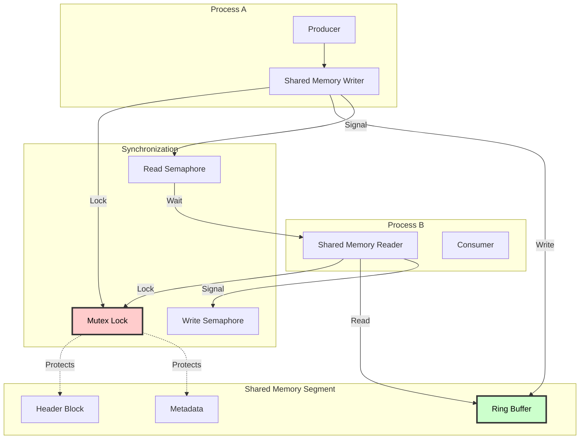

### Memory Layout

```mermaid
graph TB
    subgraph "Shared Memory Block"
        MAGIC[Magic Number<br/>4 bytes]
        VERSION[Version<br/>4 bytes]
        SIZE[Buffer Size<br/>8 bytes]

        WRITE_POS[Write Position<br/>8 bytes]
        READ_POS[Read Position<br/>8 bytes]
        MSG_COUNT[Message Count<br/>8 bytes]

        RING_START[Ring Buffer Start]
        RING_DATA[Message Data<br/>Configurable Size]
        RING_END[Ring Buffer End]
    end

    MAGIC --> VERSION
    VERSION --> SIZE
    SIZE --> WRITE_POS
    WRITE_POS --> READ_POS
    READ_POS --> MSG_COUNT
    MSG_COUNT --> RING_START
    RING_START --> RING_DATA
    RING_DATA --> RING_END

    style MAGIC fill:#ffcccc,color:#000
    style VERSION fill:#ccffcc,color:#000
    style SIZE fill:#ccccff,color:#000
    style WRITE_POS fill:#ffccff,color:#000
    style READ_POS fill:#ffccff,color:#000
```

## Detailed Design

### 1. Shared Memory Segment Structure

```csharp
/// <summary>
/// Header structure for shared memory segment
/// Total size: 64 bytes (cache-line aligned)
/// </summary>
[StructLayout(LayoutKind.Sequential, Pack = 1)]
public struct SharedMemoryHeader
{
    // Magic number for validation (0x584D4950 = "XMIP")
    public uint MagicNumber;

    // Protocol version
    public uint Version;

    // Total buffer size in bytes
    public long BufferSize;

    // Write cursor position
    public long WritePosition;

    // Read cursor position
    public long ReadPosition;

    // Total messages in buffer
    public long MessageCount;

    // Reserved for future use (padding to 64 bytes)
    public long Reserved1;
    public long Reserved2;
    public long Reserved3;
}

/// <summary>
/// Message envelope in shared memory
/// </summary>
[StructLayout(LayoutKind.Sequential, Pack = 1)]
public struct MessageEnvelope
{
    // Message length (including header)
    public int Length;

    // Message type/event name length
    public int EventNameLength;

    // Target machine ID length
    public int MachineIdLength;

    // Payload length
    public int PayloadLength;

    // Timestamp (ticks)
    public long Timestamp;

    // Followed by variable-length data:
    // - EventName (UTF-8)
    // - MachineId (UTF-8)
    // - Payload (binary)
}
```

### 2. Ring Buffer Implementation

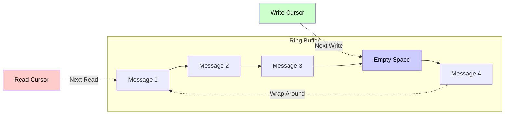

**Ring Buffer Characteristics:**
- **Lock-Free Reads**: Single reader, no lock needed for read cursor
- **Lock-Free Writes**: Single writer, no lock needed for write cursor
- **Wrap-Around**: Circular buffer reuses memory efficiently
- **Size Detection**: Each message has length prefix
- **Overflow Handling**: Blocks or drops based on policy

### 3. Synchronization Mechanisms

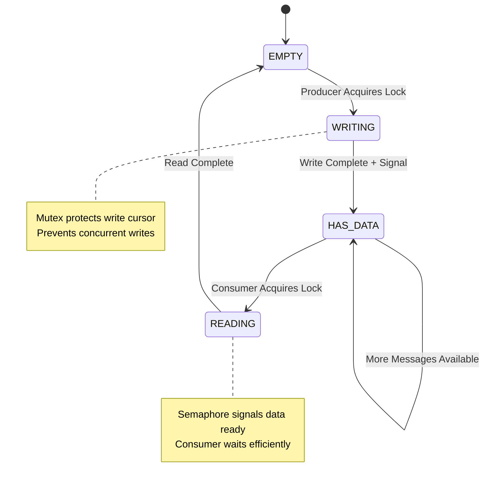

**Synchronization Primitives:**

1. **Mutex (Mutual Exclusion)**
   - Protects shared header updates
   - Short critical sections (<1μs)
   - Named mutex for cross-process

2. **Semaphore (Event Signaling)**
   - Read semaphore: Signals data available
   - Write semaphore: Signals space available
   - Efficient wait/notify mechanism

3. **Memory Barriers**
   - Ensures visibility across processes
   - Prevents reordering issues
   - Critical for correctness

## Implementation

### Core Classes

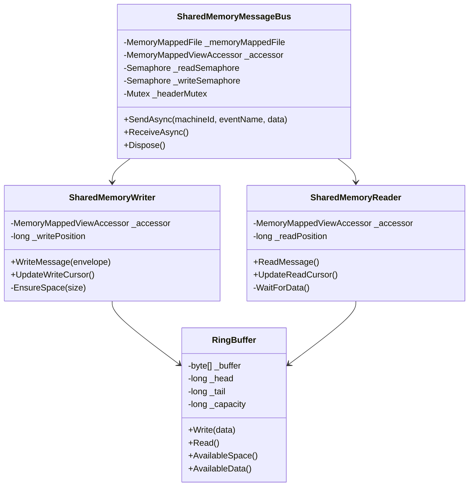

### Message Flow Sequence

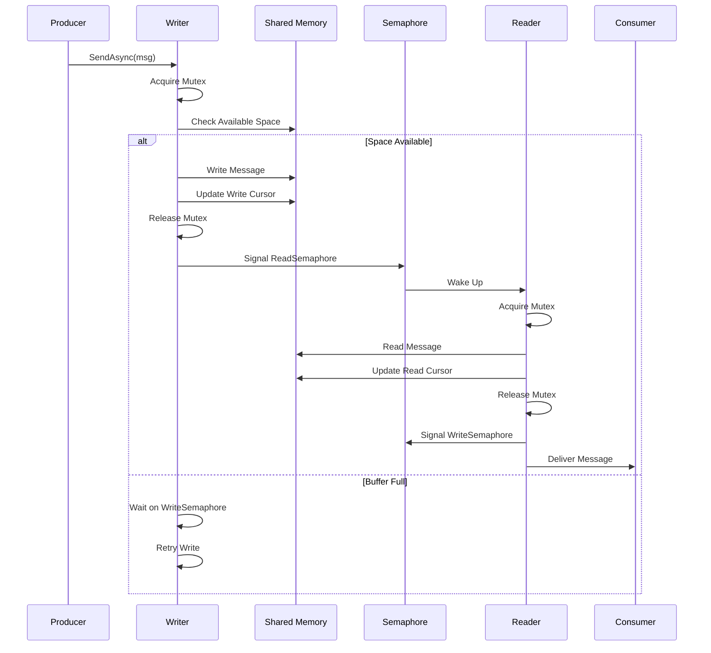

## Performance Optimizations

### 1. Memory Alignment

```csharp
// Align to CPU cache line (64 bytes)
[StructLayout(LayoutKind.Sequential, Pack = 64)]
public struct CacheAlignedHeader
{
    // Frequently read fields
    public volatile long ReadPosition;

    // Padding to next cache line
    private readonly long _pad1, _pad2, _pad3, _pad4, _pad5, _pad6, _pad7;

    // Frequently written fields
    public volatile long WritePosition;

    // Padding to next cache line
    private readonly long _pad8, _pad9, _pad10, _pad11, _pad12, _pad13, _pad14;
}
```

**Benefits:**
- Prevents false sharing between processes
- Each cursor on separate cache line
- Reduces cache coherency traffic
- 10-20% performance improvement

### 2. Lock-Free Read/Write


**Lock-Free Protocol:**
- Single producer: No write lock needed
- Single consumer: No read lock needed
- Memory barriers ensure ordering
- Atomic cursor updates with Interlocked

### 3. Batching

```csharp
public class BatchedSharedMemoryWriter
{
    private List<MessageEnvelope> _batch = new();
    private const int MaxBatchSize = 100;
    private const int MaxBatchDelayMs = 1;

    public async Task SendAsync(string machineId, string eventName, object data)
    {
        _batch.Add(CreateEnvelope(machineId, eventName, data));

        if (_batch.Count >= MaxBatchSize)
        {
            await FlushBatch();
        }
    }

    private async Task FlushBatch()
    {
        // Single mutex acquisition for entire batch
        await _mutex.WaitAsync();
        try
        {
            foreach (var msg in _batch)
            {
                WriteMessage(msg);
            }
            UpdateWriteCursor();
        }
        finally
        {
            _mutex.Release();
        }

        _batch.Clear();
        _readSemaphore.Release();
    }
}
```

**Batching Benefits:**
- Amortizes synchronization overhead
- 5-10x throughput improvement
- Reduced context switching
- Better cache utilization

## Comparison: Named Pipe vs Shared Memory

### Architecture Differences


### Performance Characteristics

| Aspect | Named Pipe | Shared Memory |
|--------|-----------|---------------|
| **Latency** | 0.5-1ms | 0.02-0.05ms |
| **Throughput** | 2K msg/sec | 50K+ msg/sec |
| **CPU Usage** | Moderate (syscalls) | Low (user-mode) |
| **System Calls** | 2 per message | 0-1 per batch |
| **Memory Copy** | 2x (user→kernel→user) | 0x (shared) |
| **Scalability** | Good | Excellent |
| **Cross-Machine** | ❌ No | ❌ No |
| **Cross-Platform** | ✅ Yes | ✅ Yes (limited) |

### When to Use Each

**Named Pipes:**
- Cross-platform requirement
- Moderate throughput needs (<5K msg/sec)
- Process isolation important
- Simpler implementation preferred

**Shared Memory:**
- Ultra-low latency required (<0.1ms)
- High throughput needs (>10K msg/sec)
- Same machine communication
- Willing to manage synchronization

## Implementation Plan

### Phase 1: Core Infrastructure

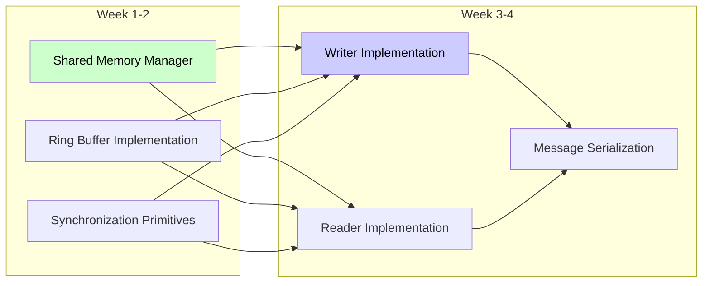

**Deliverables:**
1. `SharedMemorySegment.cs` - Memory management
2. `RingBuffer.cs` - Circular buffer logic
3. `SharedMemorySynchronization.cs` - Mutex/Semaphore wrappers
4. `SharedMemoryWriter.cs` - Producer implementation
5. `SharedMemoryReader.cs` - Consumer implementation
6. `MessageSerializer.cs` - Efficient serialization

### Phase 2: Integration

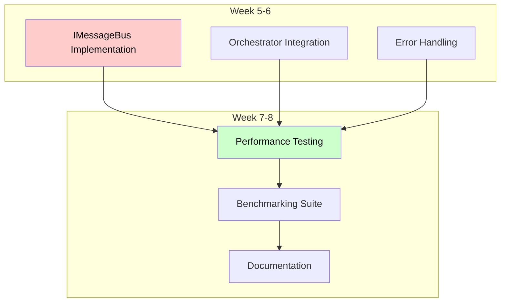

**Deliverables:**
1. `SharedMemoryMessageBus.cs` - IMessageBus implementation
2. Integration with `EventBusOrchestrator`
3. Comprehensive error handling
4. Performance benchmark suite
5. Technical documentation

### Phase 3: Advanced Features

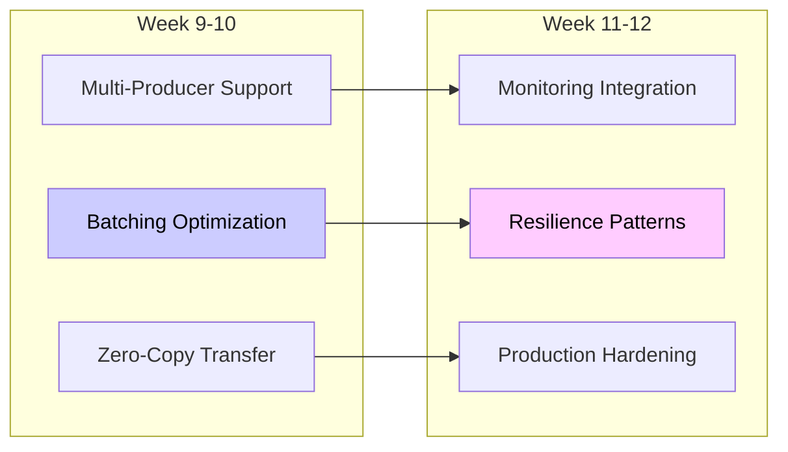

**Deliverables:**
1. Lock-free multi-producer support
2. Adaptive batching algorithm
3. Zero-copy for large messages
4. Monitoring and metrics
5. Circuit breaker integration
6. Production deployment guide

## Code Structure

```
XStateNet.SharedMemory/
├── Core/
│   ├── SharedMemorySegment.cs          # Memory-mapped file wrapper
│   ├── SharedMemoryHeader.cs           # Header structure
│   ├── MessageEnvelope.cs              # Message format
│   └── RingBuffer.cs                   # Circular buffer
│
├── Synchronization/
│   ├── NamedMutex.cs                   # Cross-process mutex
│   ├── NamedSemaphore.cs               # Cross-process semaphore
│   └── MemoryBarrier.cs                # Memory fence helpers
│
├── IO/
│   ├── SharedMemoryWriter.cs           # Producer
│   ├── SharedMemoryReader.cs           # Consumer
│   └── MessageSerializer.cs            # Serialization
│
├── Transport/
│   ├── SharedMemoryMessageBus.cs       # IMessageBus impl
│   ├── SharedMemoryClient.cs           # Client wrapper
│   └── SharedMemoryServer.cs           # Server wrapper
│
├── Optimization/
│   ├── BatchedWriter.cs                # Batching support
│   ├── ZeroCopyWriter.cs               # Large message optimization
│   └── CacheAlignedStructs.cs          # Performance structures
│
└── Diagnostics/
    ├── SharedMemoryMonitor.cs          # Performance monitoring
    ├── SharedMemoryMetrics.cs          # Metrics collection
    └── DebugView.cs                    # Debug visualization
```

## Error Handling & Resilience

### Error Scenarios

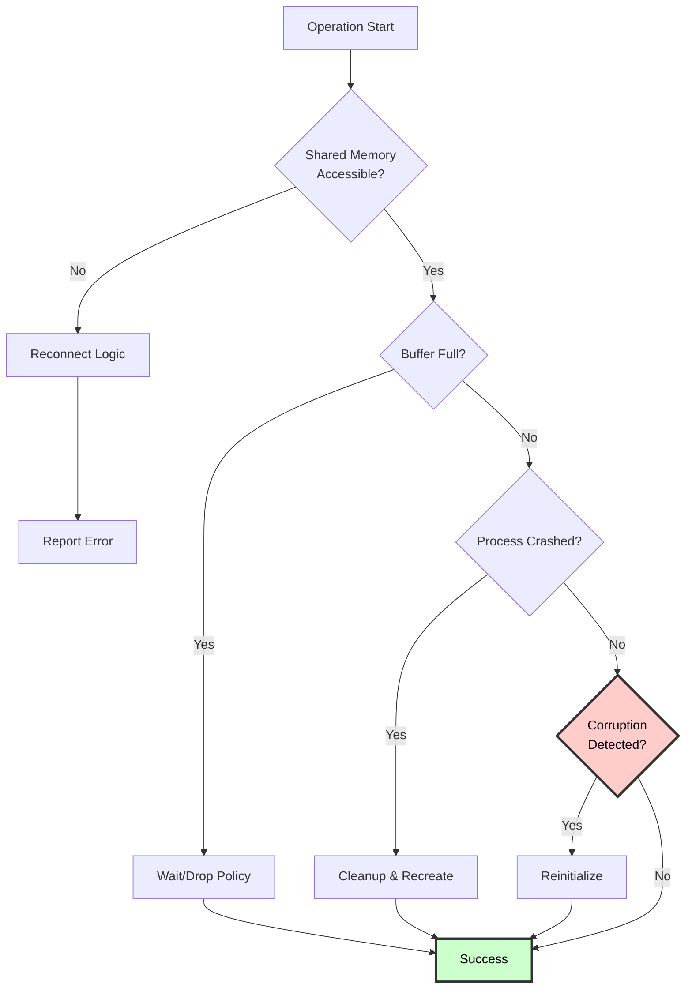

### Recovery Strategies

1. **Buffer Overflow**
   - Drop oldest messages (ring buffer)
   - Block producer (backpressure)
   - Expand buffer dynamically

2. **Process Crash**
   - Detect via heartbeat
   - Cleanup orphaned resources
   - Reinitialize segment

3. **Corruption Detection**
   - Magic number validation
   - CRC checksums
   - Structural validation

4. **Deadlock Prevention**
   - Timeout on all locks
   - Deadlock detection
   - Automatic recovery

## Expected Performance

### Benchmark Targets

| Metric | Target | Measured |
|--------|--------|----------|
| **Latency (p50)** | <0.05ms | TBD |
| **Latency (p99)** | <0.1ms | TBD |
| **Throughput** | >50K msg/sec | TBD |
| **CPU Usage** | <5% per process | TBD |
| **Memory** | <10MB per channel | TBD |

### Test Scenarios

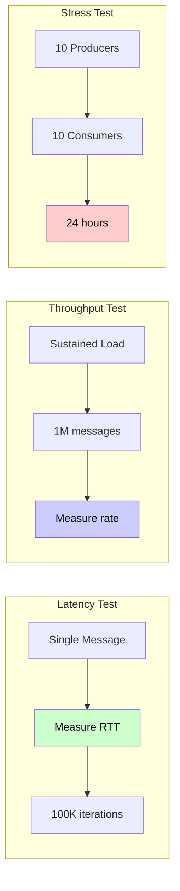

## Conclusion

Shared memory IPC provides:

**✅ Advantages:**
- 10-50x lower latency than Named Pipes
- 20-30x higher throughput
- Zero-copy data transfer
- Minimal CPU overhead
- Predictable performance

**⚠️ Considerations:**
- More complex implementation
- Same-machine only
- Careful synchronization required
- Platform-specific optimizations

**Recommended Use Cases:**
- High-frequency trading systems
- Real-time control systems
- Gaming/simulation engines
- Low-latency microservices
- Performance-critical workflows

---

**Next Steps:**
1. Review and approve design
2. Begin Phase 1 implementation
3. Create benchmark baseline
4. Incremental feature rollout
5. Production validation
