# 🧪 Testing InterProcess Orchestration - Complete Guide

## 📋 Overview

Testing **InterProcess communication** is challenging because it involves multiple processes. This guide provides strategies, patterns, and examples for thoroughly testing InterProcess orchestrated state machines.

---

## 🎯 Testing Challenges

| Challenge | Description | Solution |
|-----------|-------------|----------|
| **Process Lifecycle** | Starting/stopping multiple processes | Test harness with process management |
| **Timing Issues** | Race conditions between processes | Synchronization primitives |
| **Flaky Tests** | Non-deterministic process startup | Retry policies + health checks |
| **Isolation** | Tests interfering with each other | Unique pipe names per test |
| **Debugging** | Hard to debug across processes | Shared logging + correlation IDs |
| **CI/CD** | Slow multi-process tests | In-memory simulation mode |

---

## 🏗️ Testing Architecture

### Multi-Level Testing Strategy

```mermaid
graph TB
    subgraph Pyramid["🔺 Testing Pyramid"]
        L4["🌍 Level 4: End-to-End<br/>(Real Processes)<br/>• Actual process execution<br/>• Named pipes / real IPC<br/>• Slowest, most realistic"]
        L3["🔗 Level 3: Integration<br/>(Simulated Processes)<br/>• In-memory simulation<br/>• Shared message bus<br/>• Fast, deterministic"]
        L2["🎨 Level 2: Component<br/>(IMessageBus Mock)<br/>• Mock IPC layer<br/>• Test business logic<br/>• Very fast, isolated"]
        L1["✅ Level 1: Unit<br/>(Context Mock)<br/>• Mock Context<br/>• Test individual actions<br/>• Fastest, most isolated"]
    end

    L4 --> L3 --> L2 --> L1

    style L4 fill:#FFE6E6
    style L3 fill:#FFF4E6
    style L2 fill:#E6F3FF
    style L1 fill:#E6FFE6
```



**Testing Levels:**
- 🌍 **Level 4** = End-to-End (slowest, most realistic)
- 🔗 **Level 3** = Integration (simulated processes)
- 🎨 **Level 2** = Component (mocked transport)
- ✅ **Level 1** = Unit (mocked context, fastest)

---

## ✅ Level 1: Unit Tests (Mocked Context)

### Test Individual Actions

```csharp
[Fact]
public void ProcessOrder_Action_SendsToInventory()
{
    // Arrange
    var mockContext = new Mock<InterProcessOrchestratedContext>();
    var capturedTarget = "";
    var capturedEvent = "";

    mockContext.Setup(ctx => ctx.RequestSend(
        It.IsAny<string>(),
        It.IsAny<string>(),
        It.IsAny<object>()))
    .Callback<string, string, object>((target, evt, data) =>
    {
        capturedTarget = target;
        capturedEvent = evt;
    });

    var actions = new OrderActions();

    // Act
    actions.ProcessOrder(mockContext.Object);

    // Assert
    Assert.Equal("inventory-service", capturedTarget);
    Assert.Equal("RESERVE_ITEMS", capturedEvent);
    mockContext.Verify(ctx => ctx.RequestSend(
        "inventory-service",
        "RESERVE_ITEMS",
        It.IsAny<object>()), Times.Once);
}
```

### Test Action Logic

```csharp
[Theory]
[InlineData(100, "PROCESS")]  // Valid amount
[InlineData(0, "REJECT")]     // Invalid amount
public void ValidateOrder_Action_CorrectEvent(decimal amount, string expectedEvent)
{
    // Arrange
    var mockContext = new Mock<InterProcessOrchestratedContext>();
    mockContext.Setup(ctx => ctx.EventData).Returns(new { Amount = amount });

    var capturedEvent = "";
    mockContext.Setup(ctx => ctx.RequestSelfSend(It.IsAny<string>(), null))
        .Callback<string, object>((evt, _) => capturedEvent = evt);

    var actions = new OrderActions();

    // Act
    actions.ValidateOrder(mockContext.Object);

    // Assert
    Assert.Equal(expectedEvent, capturedEvent);
}
```

---

## 🎨 Level 2: Component Tests (Mocked IMessageBus)

### Test State Machine Logic with Mocked Transport

```csharp
public class OrderMachineComponentTests : IDisposable
{
    private readonly Mock<IMessageBus> _mockBus;
    private readonly List<(string target, string evt, object? data)> _sentEvents;

    public OrderMachineComponentTests()
    {
        _mockBus = new Mock<IMessageBus>();
        _sentEvents = new List<(string, string, object?)>();

        // Capture all sends
        _mockBus.Setup(bus => bus.SendEventAsync(
            It.IsAny<string>(),
            It.IsAny<string>(),
            It.IsAny<string>(),
            It.IsAny<object>()))
        .Callback<string, string, string, object>((src, target, evt, data) =>
        {
            _sentEvents.Add((target, evt, data));
        })
        .Returns(Task.CompletedTask);

        _mockBus.Setup(bus => bus.ConnectAsync()).Returns(Task.CompletedTask);
    }

    [Fact]
    public async Task OrderMachine_OnStart_RequestsInventoryCheck()
    {
        // Arrange
        var machine = InterProcessStateMachineFactory.CreateFromScript(
            id: "order-1",
            json: OrderMachineJson,
            messageBus: _mockBus.Object,
            actions: GetOrderActions());

        // Act
        await machine.StartAsync();

        // Assert
        Assert.Contains(_sentEvents, e =>
            e.target == "inventory-service" &&
            e.evt == "CHECK_AVAILABILITY");
    }

    [Fact]
    public async Task OrderMachine_OnInventoryOK_SendsPaymentRequest()
    {
        // Arrange
        var machine = InterProcessStateMachineFactory.CreateFromScript(
            id: "order-1",
            json: OrderMachineJson,
            messageBus: _mockBus.Object,
            actions: GetOrderActions());

        await machine.StartAsync();
        _sentEvents.Clear(); // Clear startup events

        // Act - Simulate inventory response
        await machine.SendAsync("INVENTORY_OK", new { Items = 5 });
        await Task.Delay(50); // Allow processing

        // Assert
        Assert.Contains(_sentEvents, e =>
            e.target == "payment-service" &&
            e.evt == "CHARGE");
    }

    public void Dispose()
    {
        _mockBus.Object?.Dispose();
    }
}
```

---

## 🔗 Level 3: Integration Tests (Simulated Processes)

### In-Memory Multi-Process Simulation

```csharp
public class OrderPipelineIntegrationTests : IDisposable
{
    private readonly InMemoryMessageBus _sharedBus;
    private readonly List<IPureStateMachine> _machines;

    public OrderPipelineIntegrationTests()
    {
        // Single in-memory bus simulates IPC
        _sharedBus = new InMemoryMessageBus();
        _machines = new List<IPureStateMachine>();
    }

    [Fact]
    public async Task FullOrderPipeline_Success()
    {
        // Arrange - Create 3 "processes" (machines) on shared bus
        var orderMachine = await CreateMachine("order-service", OrderJson, GetOrderActions());
        var inventoryMachine = await CreateMachine("inventory-service", InventoryJson, GetInventoryActions());
        var paymentMachine = await CreateMachine("payment-service", PaymentJson, GetPaymentActions());

        _machines.AddRange(new[] { orderMachine, inventoryMachine, paymentMachine });

        var orderCompleted = new TaskCompletionSource<bool>();

        // Listen for completion event
        await _sharedBus.SubscribeAsync("order-service", async evt =>
        {
            if (evt.EventName == "ORDER_COMPLETE")
                orderCompleted.SetResult(true);
        });

        // Act - Trigger order
        await _sharedBus.SendEventAsync("test", "order-service", "START_ORDER", new
        {
            OrderId = "ORD-123",
            Items = new[] { "ITEM-1", "ITEM-2" },
            Amount = 99.99m
        });

        // Assert - Wait for completion (with timeout)
        var completed = await Task.WhenAny(
            orderCompleted.Task,
            Task.Delay(5000));

        Assert.True(completed == orderCompleted.Task, "Order should complete within 5 seconds");
        Assert.True(await orderCompleted.Task, "Order should complete successfully");
    }

    [Fact]
    public async Task OrderPipeline_InventoryFailed_OrderRejected()
    {
        // Arrange
        var orderMachine = await CreateMachine("order-service", OrderJson, GetOrderActions());
        var inventoryMachine = await CreateMachine("inventory-service", InventoryJson, GetInventoryActions());

        var orderRejected = new TaskCompletionSource<string>();

        await _sharedBus.SubscribeAsync("order-service", async evt =>
        {
            if (evt.EventName == "ORDER_REJECTED")
                orderRejected.SetResult(evt.Payload?.ToString() ?? "");
        });

        // Act - Trigger order with unavailable items
        await _sharedBus.SendEventAsync("test", "order-service", "START_ORDER", new
        {
            OrderId = "ORD-456",
            Items = new[] { "OUT_OF_STOCK" },
            Amount = 50m
        });

        // Assert
        var reason = await orderRejected.Task.WaitAsync(TimeSpan.FromSeconds(5));
        Assert.Contains("insufficient inventory", reason, StringComparison.OrdinalIgnoreCase);
    }

    private async Task<IPureStateMachine> CreateMachine(
        string id, string json,
        Dictionary<string, Action<InterProcessOrchestratedContext>> actions)
    {
        var machine = InterProcessStateMachineFactory.CreateFromScript(
            id: id,
            json: json,
            messageBus: _sharedBus,
            actions: actions);

        await machine.StartAsync();
        return machine;
    }

    public void Dispose()
    {
        foreach (var machine in _machines)
            machine?.Dispose();
        _sharedBus?.Dispose();
    }
}
```

---

## 🌍 Level 4: End-to-End Tests (Real Processes)

### Process Test Harness

```csharp
public class ProcessTestHarness : IDisposable
{
    private readonly List<Process> _processes = new();
    private readonly string _testPipeName;

    public ProcessTestHarness()
    {
        // Unique pipe name per test to avoid conflicts
        _testPipeName = $"XStateNet.Test.{Guid.NewGuid():N}";
    }

    public async Task<Process> StartProcess(string exePath, string[] args)
    {
        var process = new Process
        {
            StartInfo = new ProcessStartInfo
            {
                FileName = exePath,
                Arguments = string.Join(" ", args.Concat(new[] { $"--pipe={_testPipeName}" })),
                RedirectStandardOutput = true,
                RedirectStandardError = true,
                UseShellExecute = false,
                CreateNoWindow = true
            }
        };

        // Capture output for debugging
        process.OutputDataReceived += (s, e) =>
        {
            if (!string.IsNullOrEmpty(e.Data))
                TestContext.WriteLine($"[{process.Id}] {e.Data}");
        };

        process.ErrorDataReceived += (s, e) =>
        {
            if (!string.IsNullOrEmpty(e.Data))
                TestContext.WriteError($"[{process.Id}] ERROR: {e.Data}");
        };

        process.Start();
        process.BeginOutputReadLine();
        process.BeginErrorReadLine();

        _processes.Add(process);

        // Wait for process to be ready
        await WaitForProcessReady(process);

        return process;
    }

    private async Task WaitForProcessReady(Process process, int timeoutMs = 5000)
    {
        var sw = Stopwatch.StartNew();
        while (sw.ElapsedMilliseconds < timeoutMs)
        {
            // Check if process wrote "READY" to output
            // Or implement health check endpoint
            await Task.Delay(100);

            // Implementation depends on your process startup signal
        }
    }

    public void Dispose()
    {
        foreach (var process in _processes)
        {
            try
            {
                if (!process.HasExited)
                {
                    process.Kill(entireProcessTree: true);
                    process.WaitForExit(1000);
                }
            }
            catch { }
        }
    }
}
```

### Real Multi-Process Test

```csharp
[Collection("ProcessTests")] // Run sequentially
public class MultiProcessOrderTests : IDisposable
{
    private readonly ProcessTestHarness _harness;

    public MultiProcessOrderTests()
    {
        _harness = new ProcessTestHarness();
    }

    [Fact]
    public async Task RealProcesses_OrderPipeline_Success()
    {
        // Arrange - Start all service processes
        var orderService = await _harness.StartProcess(
            "OrderService.exe",
            new[] { "--mode=test" });

        var inventoryService = await _harness.StartProcess(
            "InventoryService.exe",
            new[] { "--mode=test" });

        var paymentService = await _harness.StartProcess(
            "PaymentService.exe",
            new[] { "--mode=test" });

        // Wait for all services to be ready
        await Task.Delay(2000);

        // Act - Send test order via HTTP or file trigger
        var result = await SendTestOrder(new
        {
            OrderId = "TEST-001",
            Items = new[] { "ITEM-1" },
            Amount = 100m
        });

        // Assert
        Assert.Equal("COMPLETED", result.Status);
        Assert.NotNull(result.PaymentId);
    }

    public void Dispose()
    {
        _harness?.Dispose();
    }
}
```

---

## 🎛️ Test Patterns & Best Practices

### Pattern 1: Synchronization Points

```csharp
public class SynchronizedTest
{
    private readonly ManualResetEventSlim _orderProcessed = new(false);
    private readonly ManualResetEventSlim _paymentComplete = new(false);

    [Fact]
    public async Task Pipeline_WithSynchronization()
    {
        // Setup listeners
        await _messageBus.SubscribeAsync("order-service", async evt =>
        {
            if (evt.EventName == "ORDER_PROCESSED")
                _orderProcessed.Set();
        });

        await _messageBus.SubscribeAsync("payment-service", async evt =>
        {
            if (evt.EventName == "PAYMENT_COMPLETE")
                _paymentComplete.Set();
        });

        // Act
        await TriggerOrder();

        // Assert - Wait for specific milestones
        Assert.True(_orderProcessed.Wait(5000), "Order should be processed");
        Assert.True(_paymentComplete.Wait(5000), "Payment should complete");
    }
}
```

### Pattern 2: Event Spy

```csharp
public class EventSpy : IDisposable
{
    private readonly ConcurrentQueue<MachineEvent> _events = new();
    private IDisposable? _subscription;

    public async Task<EventSpy> AttachTo(IMessageBus bus, string machineId)
    {
        _subscription = await bus.SubscribeAsync(machineId, async evt =>
        {
            _events.Enqueue(evt);
        });
        return this;
    }

    public async Task<MachineEvent> WaitForEvent(
        string eventName,
        TimeSpan? timeout = null)
    {
        var deadline = DateTime.UtcNow + (timeout ?? TimeSpan.FromSeconds(5));

        while (DateTime.UtcNow < deadline)
        {
            if (_events.TryDequeue(out var evt) && evt.EventName == eventName)
                return evt;

            await Task.Delay(10);
        }

        throw new TimeoutException($"Event '{eventName}' not received within timeout");
    }

    public List<MachineEvent> GetAllEvents() => _events.ToList();

    public void Dispose() => _subscription?.Dispose();
}

// Usage
[Fact]
public async Task Test_WithEventSpy()
{
    var spy = await new EventSpy().AttachTo(_messageBus, "order-service");

    await TriggerOrder();

    var evt = await spy.WaitForEvent("ORDER_COMPLETE");
    Assert.NotNull(evt.Payload);
}
```

### Pattern 3: Deterministic Delays

```csharp
public class DeterministicTestClock : ITestClock
{
    private TimeSpan _currentTime = TimeSpan.Zero;

    public void Advance(TimeSpan duration) => _currentTime += duration;
    public TimeSpan Now => _currentTime;
}

[Fact]
public async Task DelayedEvent_WithDeterministicClock()
{
    var clock = new DeterministicTestClock();
    var machine = CreateMachineWithClock(clock);

    // Schedule delayed event
    await machine.SendAsync("SCHEDULE_DELAYED", new { Delay = 5000 });

    // Advance time instead of actual delay
    clock.Advance(TimeSpan.FromSeconds(5));

    // Trigger time check
    await machine.SendAsync("TICK");

    // Assert delayed event processed
    Assert.Contains("completed", machine.CurrentState);
}
```

---

## 🐛 Debugging Multi-Process Tests

### Correlation IDs

```csharp
public class CorrelatedContext : InterProcessOrchestratedContext
{
    private readonly string _correlationId;

    public CorrelatedContext(string correlationId)
    {
        _correlationId = correlationId;
    }

    public override void RequestSend(string target, string evt, object? data)
    {
        var enrichedData = new
        {
            CorrelationId = _correlationId,
            Data = data
        };

        base.RequestSend(target, evt, enrichedData);

        // Log for debugging
        Logger.Debug($"[{_correlationId}] {MachineId} → {target}: {evt}");
    }
}
```

### Shared Test Logger

```csharp
public class SharedTestLogger
{
    private static readonly ConcurrentQueue<string> _logs = new();

    public static void Log(string message)
    {
        var entry = $"[{DateTime.UtcNow:HH:mm:ss.fff}] {message}";
        _logs.Enqueue(entry);
        Console.WriteLine(entry);
    }

    public static void DumpLogs()
    {
        Console.WriteLine("=== Test Execution Log ===");
        foreach (var log in _logs)
            Console.WriteLine(log);
    }
}

// In processes
SharedTestLogger.Log($"[OrderService] Received event: {evt.EventName}");

// In test
[Fact]
public async Task Test()
{
    try
    {
        // Run test
    }
    finally
    {
        SharedTestLogger.DumpLogs();
    }
}
```

---

## 📊 Performance Testing

```csharp
[Fact]
public async Task Throughput_1000Orders_Under10Seconds()
{
    // Arrange
    var orderService = await CreateMachine("order-service", ...);
    var completedCount = 0;

    await _messageBus.SubscribeAsync("order-service", async evt =>
    {
        if (evt.EventName == "ORDER_COMPLETE")
            Interlocked.Increment(ref completedCount);
    });

    var sw = Stopwatch.StartNew();

    // Act - Send 1000 orders
    var tasks = Enumerable.Range(0, 1000).Select(i =>
        _messageBus.SendEventAsync("test", "order-service", "START_ORDER", new
        {
            OrderId = $"ORD-{i}",
            Items = new[] { "ITEM-1" },
            Amount = 100m
        }));

    await Task.WhenAll(tasks);

    // Wait for processing
    await Task.Delay(TimeSpan.FromSeconds(10));

    sw.Stop();

    // Assert
    Assert.True(completedCount >= 950, $"Expected 950+ orders, got {completedCount}");
    Assert.True(sw.Elapsed < TimeSpan.FromSeconds(10), "Should complete in under 10 seconds");

    var throughput = completedCount / sw.Elapsed.TotalSeconds;
    Console.WriteLine($"Throughput: {throughput:F0} orders/sec");
}
```

---

## ✅ Summary

### Test Strategy Checklist

- [ ] ✅ **Unit Tests**: Test individual actions with mocked context (fast, isolated)
- [ ] 🎨 **Component Tests**: Test state machines with mocked message bus (medium speed)
- [ ] 🔗 **Integration Tests**: Test multiple machines with in-memory bus (slower, realistic)
- [ ] 🌍 **E2E Tests**: Test real processes with real IPC (slowest, most realistic)

### Best Practices

1. ✅ Use **unique pipe names** per test to avoid conflicts
2. ✅ Implement **synchronization primitives** for deterministic tests
3. ✅ Add **correlation IDs** for debugging multi-process flows
4. ✅ Use **test harness** for process lifecycle management
5. ✅ Implement **health checks** to ensure process readiness
6. ✅ Add **timeout protection** on all async operations
7. ✅ Use **EventSpy pattern** to capture and verify events
8. ✅ Prefer **in-memory simulation** for CI/CD speed

### Performance Targets

| Test Type | Execution Time | When to Run |
|-----------|----------------|-------------|
| Unit | < 100ms | Every commit |
| Component | < 500ms | Every commit |
| Integration | < 5s | Pre-push |
| E2E | < 30s | CI/CD pipeline |

---

**Next**: See [INTERPROCESS_ORCHESTRATED_PATTERN.md](./INTERPROCESS_ORCHESTRATED_PATTERN.md) for implementation details.
