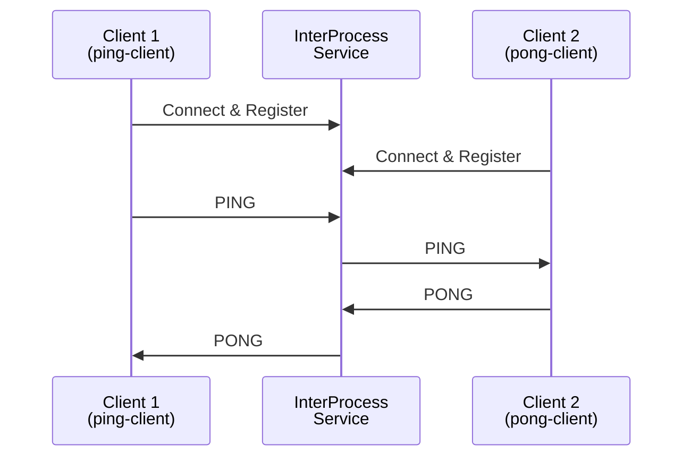
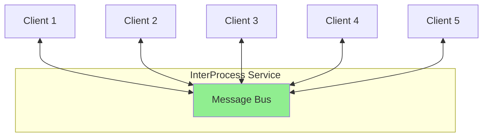

# 🧪 Testing XStateNet InterProcess Service

Complete guide for testing the InterProcess Service with step-by-step instructions.

---

## 📋 Prerequisites

Before testing, ensure you have:

1. ✅ Built the InterProcess Service
2. ✅ Built the Test Client application
3. ✅ Administrator privileges (for Windows Service installation)

---

## 🚀 Quick Test (3 Steps)

### Step 1: Build Everything

```powershell
# Build the service
cd XStateNet.InterProcess.Service
dotnet build -c Release
cd ..

# Build the test client
cd XStateNet.InterProcess.TestClient
dotnet build -c Release
cd ..
```

### Step 2: Start the Service

**Option A: Console Mode (Recommended for Testing)**

```powershell
cd XStateNet.InterProcess.Service\bin\Release\net9.0
.\XStateNet.InterProcess.Service.exe
```

Leave this terminal running.

**Option B: Windows Service Mode**

```powershell
# Install as Windows Service (Run as Administrator)
cd XStateNet.InterProcess.Service
.\install-service.ps1

# Check status
Get-Service XStateNetMessageBus
```

### Step 3: Run Test Client

Open a **new terminal** and run:

```powershell
cd XStateNet.InterProcess.TestClient\bin\Release\net9.0
.\XStateNet.InterProcess.TestClient.exe
```

---

## 📊 Test Scenarios

### Test 1: Ping-Pong (2 Clients)

Tests basic bi-directional communication between two clients.



**How to run:**

```powershell
# In test client, select option 1
.\XStateNet.InterProcess.TestClient.exe ping
```

**Expected output:**

```
[ping-client] Sending PING #1
[pong-client] Received PING, sending PONG back...
[ping-client] Received PONG #1
...
✓ Test Complete! Received 5/5 PONGs
```

---

### Test 2: Multi-Client (5 Clients)

Tests message routing between multiple clients.



**How to run:**

```powershell
.\XStateNet.InterProcess.TestClient.exe multi
```

**Expected output:**

```
✓ All 5 clients connected

[client-1] Broadcasting message...
[client-2] Received broadcast from client-1
[client-3] Received broadcast from client-1
...

Results:
  client-1: received 4/4 broadcasts
  client-2: received 4/4 broadcasts
  ...
✓ Total: 20/20 messages delivered
```

---

### Test 3: Stress Test (Performance)

Tests throughput and latency under load.

**How to run:**

```powershell
.\XStateNet.InterProcess.TestClient.exe stress
```

**Expected output:**

```
Sending 100 messages...
....................
✓ Sent: 100 messages
✓ Received: 100 messages
✓ Time: 45ms
✓ Throughput: 2222 msg/sec
✓ Avg Latency: 0.45ms per message
```

**Performance Targets:**

| Metric | Target | Good | Excellent |
|--------|--------|------|-----------|
| **Throughput** | > 1000 msg/sec | > 5000 | > 10000 |
| **Latency** | < 5ms | < 1ms | < 0.5ms |
| **Message Loss** | 0% | 0% | 0% |

---

### Test 4: Custom Test (Interactive)

Manual testing with custom commands.

**How to run:**

```powershell
.\XStateNet.InterProcess.TestClient.exe

# Select option 4
```

**Commands:**

```
send <target> <event> [message]  - Send event to target machine
quit                             - Exit
```

**Example session:**

```
[my-client]> send worker-1 START_JOB Hello Worker
✓ Sent START_JOB to worker-1

[my-client]> quit
```

---

## 🎯 Complete Testing Workflow

### Terminal 1: Service (Console Mode)

```powershell
cd C:\Develop25\XStateNet\XStateNet.InterProcess.Service\bin\Release\net9.0
.\XStateNet.InterProcess.Service.exe
```

**Expected output:**

```
info: XStateNet.InterProcess.Service.InterProcessMessageBusWorker[0]
      InterProcess Message Bus Service starting...
info: XStateNet.InterProcess.Service.NamedPipeMessageBus[0]
      Starting Named Pipe Message Bus on pipe: XStateNet.MessageBus
info: XStateNet.InterProcess.Service.InterProcessMessageBusWorker[0]
      InterProcess Message Bus Service started successfully
```

### Terminal 2: Test Client

```powershell
cd C:\Develop25\XStateNet\XStateNet.InterProcess.TestClient\bin\Release\net9.0
.\XStateNet.InterProcess.TestClient.exe
```

**Select tests from menu:**

```
Select Test:
  1. Ping-Pong Test (2 clients exchanging messages)
  2. Multi-Client Test (5 clients broadcasting)
  3. Stress Test (100+ messages/sec)
  4. Custom Test (manual control)
  5. Exit

Choice [1-5]:
```

### Terminal 1: Service Logs

While tests run, observe service logs:

```
info: XStateNet.InterProcess.Service.NamedPipeMessageBus[0]
      Client connected. Total connections: 1
info: XStateNet.InterProcess.Service.NamedPipeMessageBus[0]
      Machine registered: ping-client (PID: 12345)
info: XStateNet.InterProcess.Service.NamedPipeMessageBus[0]
      Routing event: ping-client -> pong-client: PING
```

---

## 🔍 Troubleshooting

### Problem 1: "Failed to connect to pipe"

**Error:**
```
Failed to connect to pipe 'XStateNet.MessageBus'. Is the InterProcess Service running?
```

**Solution:**

1. Check if service is running:
```powershell
# Console mode
# Look for service terminal window

# Service mode
Get-Service XStateNetMessageBus
```

2. If not running, start it:
```powershell
# Console mode
cd XStateNet.InterProcess.Service\bin\Release\net9.0
.\XStateNet.InterProcess.Service.exe

# Service mode
Start-Service XStateNetMessageBus
```

---

### Problem 2: Messages Not Being Received

**Symptoms:**
- Test shows "Sent: 5 messages, Received: 0 messages"
- No events appearing in receiver

**Diagnostics:**

1. Check service logs for errors
2. Verify both clients are registered:
```
info: Machine registered: sender-1
info: Machine registered: receiver-1
```

3. Check if events are being routed:
```
info: Routing event: sender-1 -> receiver-1: TEST_EVENT
```

**Solutions:**

- Ensure clients are using correct machine IDs
- Add delay between registration and sending (100ms)
- Check firewall/antivirus not blocking named pipes

---

### Problem 3: Poor Performance

**Symptoms:**
- Throughput < 1000 msg/sec
- High latency (> 10ms per message)

**Diagnostics:**

```powershell
# Check service resource usage
Get-Process XStateNet.InterProcess.Service | Select-Object CPU, WorkingSet64
```

**Solutions:**

1. Increase buffer size in service configuration
2. Reduce logging verbosity (change to Warning/Error)
3. Run service with higher priority:
```powershell
$process = Get-Process XStateNet.InterProcess.Service
$process.PriorityClass = 'High'
```

---

## 📈 Advanced Testing

### Multiple Processes Test

Test communication between separate process instances:

**Terminal 1: Service**
```powershell
.\XStateNet.InterProcess.Service.exe
```

**Terminal 2: Client A (Process 1)**
```powershell
.\XStateNet.InterProcess.TestClient.exe
# Select option 4 (Custom Test)
# Enter machine ID: process-a
```

**Terminal 3: Client B (Process 2)**
```powershell
.\XStateNet.InterProcess.TestClient.exe
# Select option 4 (Custom Test)
# Enter machine ID: process-b
```

**Send messages between processes:**

In Terminal 2:
```
[process-a]> send process-b HELLO Hello from Process A
```

In Terminal 3 (should receive):
```
✓ Received: HELLO from process-a
```

---

### Load Test (Concurrent Clients)

Test with many concurrent clients:

```powershell
# Start service
.\XStateNet.InterProcess.Service.exe

# Open 10 terminals and run:
for ($i=1; $i -le 10; $i++) {
    Start-Process powershell -ArgumentList "-NoExit", "-Command", "cd '$PWD'; .\XStateNet.InterProcess.TestClient.exe multi"
}
```

Monitor service:
```
info: Health Check - Connections: 50, Machines: 50, Last Activity: 2025-10-03 10:30:45
```

---

## ✅ Test Results Checklist

After running all tests, verify:

- [ ] ✅ **Ping-Pong Test**: 5/5 messages delivered
- [ ] ✅ **Multi-Client Test**: 20/20 messages delivered
- [ ] ✅ **Stress Test**: 100% message delivery
- [ ] ✅ **Throughput**: > 1000 msg/sec
- [ ] ✅ **Latency**: < 5ms average
- [ ] ✅ **Service Uptime**: No crashes during tests
- [ ] ✅ **Memory**: No memory leaks (stable over time)
- [ ] ✅ **Connection Handling**: Clean connect/disconnect

---

## 🎓 Next Steps

After successful testing:

1. **Production Deployment**: See [INTERPROCESS_SERVICE_GUIDE.md](./INTERPROCESS_SERVICE_GUIDE.md#installation--deployment)

2. **Build Real Applications**: Use the `InterProcessClient` as a template for your state machines

3. **Monitor in Production**: Set up logging and monitoring

4. **Scale Testing**: Test with your expected production load

---

## 📚 Related Documentation

- [INTERPROCESS_SERVICE_GUIDE.md](./INTERPROCESS_SERVICE_GUIDE.md) - Complete service documentation
- [INTERPROCESS_ORCHESTRATED_PATTERN.md](./INTERPROCESS_ORCHESTRATED_PATTERN.md) - Architecture patterns
- [TESTING_INTERPROCESS_GUIDE.md](./TESTING_INTERPROCESS_GUIDE.md) - Testing strategies

---

## 🎯 Summary

### Quick Commands Reference

```powershell
# Build everything
dotnet build -c Release

# Run service (console mode)
cd XStateNet.InterProcess.Service\bin\Release\net9.0
.\XStateNet.InterProcess.Service.exe

# Run tests
cd XStateNet.InterProcess.TestClient\bin\Release\net9.0
.\XStateNet.InterProcess.TestClient.exe ping    # Ping-pong test
.\XStateNet.InterProcess.TestClient.exe multi   # Multi-client test
.\XStateNet.InterProcess.TestClient.exe stress  # Stress test
.\XStateNet.InterProcess.TestClient.exe         # Interactive menu

# Install as Windows Service
cd XStateNet.InterProcess.Service
.\install-service.ps1

# Check service status
Get-Service XStateNetMessageBus

# View service logs
Get-EventLog -LogName Application -Source "XStateNet.InterProcess" -Newest 20
```

**Happy Testing!** 🎉
