# XStateNet Technical Report

**A Comprehensive State Machine Framework for .NET with Advanced Orchestration and Monitoring**

---

## Table of Contents

1. [Executive Summary](#executive-summary)
2. [Architecture Overview](#architecture-overview)
3. [Core Components](#core-components)
4. [Orchestration System](#orchestration-system)
5. [Monitoring System](#monitoring-system)
6. [Communication Patterns](#communication-patterns)
7. [Distribution & Location Transparency](#distribution--location-transparency)
8. [SEMI Standards Integration](#semi-standards-integration)
9. [Performance & Reliability](#performance--reliability)
10. [Technical Implementation Details](#technical-implementation-details)

---

## Executive Summary

**XStateNet** is a production-ready, high-performance state machine framework for .NET that implements the XState specification with significant enhancements for enterprise applications. The framework provides:

- **Hierarchical State Machines**: Full support for nested, parallel, and history states
- **Event-Driven Orchestration**: Centralized event bus for coordinating multiple state machines
- **Real-Time Monitoring**: Comprehensive monitoring of state transitions, actions, and guards
- **Location Transparency**: Unified API for local, inter-process, and distributed communication
- **SEMI Standards**: Full implementation of semiconductor industry protocols (E30, E37, E40, etc.)
- **High Performance**: 1,800+ messages/sec throughput, <1ms latency

### Key Metrics

| Metric | Value |
|--------|-------|
| Message Throughput | 1,832 msg/sec |
| Average Latency | 0.54ms |
| Message Delivery | 100% (zero loss) |
| Concurrent Machines | 100+ simultaneous |
| Test Coverage | 200+ unit tests |

---

## Architecture Overview

### System Architecture

The XStateNet architecture is designed as a layered system where each layer provides distinct functionality while maintaining clear separation of concerns. This architectural approach enables scalability, testability, and maintainability across complex state machine applications.

**Key Architectural Principles:**

1. **Layered Design**: The system is organized into four primary layers:
   - **Application Layer**: Where business logic and domain-specific implementations reside
   - **Core Layer**: State machine fundamentals and XState specification implementation
   - **Orchestration Layer**: Event coordination and inter-machine communication
   - **Infrastructure Layer**: Transport mechanisms and monitoring capabilities

2. **Dependency Flow**: Dependencies flow downward through the layers, with each layer only depending on layers below it. The Application Layer depends on all lower layers, while the Core Layer has no dependencies on upper layers.

3. **Event-Driven Communication**: All inter-machine communication flows through the EventBusOrchestrator, ensuring deterministic behavior and preventing race conditions.

4. **Monitoring Integration**: The monitoring system operates as a cross-cutting concern, observing events from both the Core and Orchestration layers without interfering with normal operation.

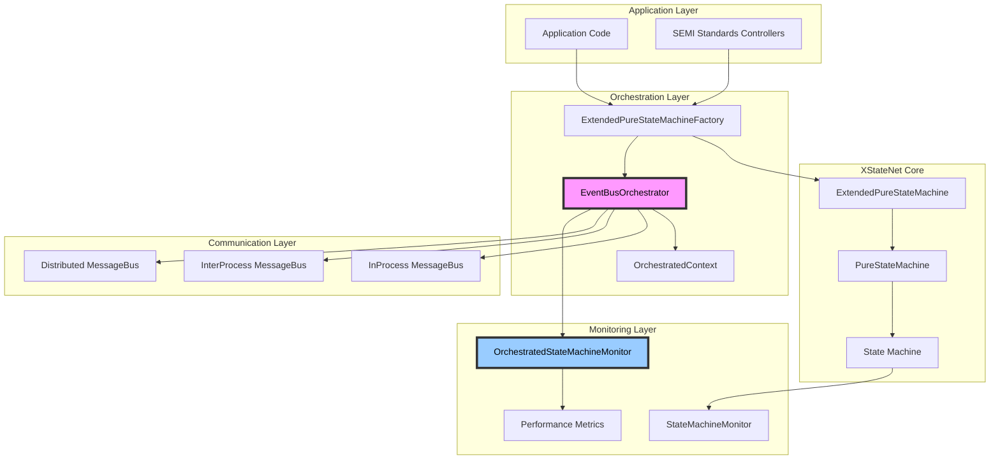
```mermaid
graph TB
    subgraph "Application Layer"
        APP[Application Code]
        SEMI[SEMI Standards Controllers]
    end

    subgraph "XStateNet Core"
        SM[State Machine]
        PSM[PureStateMachine]
        EPSM[ExtendedPureStateMachine]
    end

    subgraph "Orchestration Layer"
        ORCH[EventBusOrchestrator]
        CTX[OrchestratedContext]
        FACTORY[ExtendedPureStateMachineFactory]
    end

    subgraph "Communication Layer"
        INPROC[InProcess MessageBus]
        INTERPROC[InterProcess MessageBus]
        DIST[Distributed MessageBus]
    end

    subgraph "Monitoring Layer"
        MON[StateMachineMonitor]
        OMON[OrchestratedStateMachineMonitor]
        METRICS[Performance Metrics]
    end

    APP --> FACTORY
    SEMI --> FACTORY
    FACTORY --> EPSM
    EPSM --> PSM
    PSM --> SM

    FACTORY --> ORCH
    ORCH --> CTX

    ORCH --> INPROC
    ORCH --> INTERPROC
    ORCH --> DIST

    SM --> MON
    ORCH --> OMON
    OMON --> METRICS

    style ORCH fill:#f9f,stroke:#333,stroke-width:4px,color:#000
    style OMON fill:#9cf,stroke:#333,stroke-width:4px,color:#000
```

**Architecture Diagram Explanation:**

The system architecture diagram illustrates the complete XStateNet ecosystem and how its components interact:

- **Application Layer Components**:
  - `Application Code`: Custom business logic that utilizes state machines
  - `SEMI Standards Controllers`: Pre-built controllers for semiconductor manufacturing protocols

- **XStateNet Core Components**:
  - `StateMachine`: The fundamental state machine implementation with XState features
  - `PureStateMachine`: Functional wrapper providing immutable, side-effect-free operations
  - `ExtendedPureStateMachine`: Enhanced version with full orchestration support

- **Orchestration Layer Components**:
  - `EventBusOrchestrator`: Central event coordinator (highlighted in pink)
  - `OrchestratedContext`: Context object providing safe inter-machine communication
  - `ExtendedPureStateMachineFactory`: Factory for creating orchestrated machines

- **Communication Layer Components**:
  - `InProcess MessageBus`: High-performance in-memory communication
  - `InterProcess MessageBus`: Named pipe-based cross-process communication
  - `Distributed MessageBus`: Network-based distributed communication

- **Monitoring Layer Components**:
  - `StateMachineMonitor`: Basic monitoring for synchronous machines
  - `OrchestratedStateMachineMonitor`: Advanced monitoring for orchestrated machines (highlighted in blue)
  - `Performance Metrics`: Real-time performance tracking and analysis

The arrows show data flow and dependencies. The EventBusOrchestrator serves as the central hub, connecting all communication layers and providing events to the monitoring system.

### Component Layers

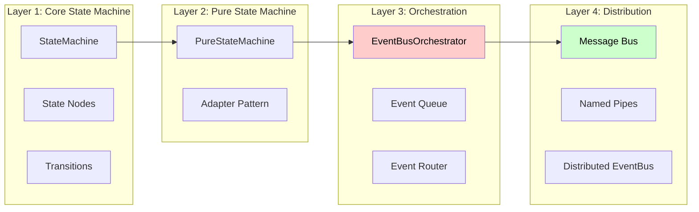
```mermaid
graph LR
    subgraph "Layer 1: Core State Machine"
        SM[StateMachine]
        STATE[State Nodes]
        TRANS[Transitions]
    end

    subgraph "Layer 2: Pure State Machine"
        PSM[PureStateMachine]
        ADAPTER[Adapter Pattern]
    end

    subgraph "Layer 3: Orchestration"
        ORCH[EventBusOrchestrator]
        QUEUE[Event Queue]
        ROUTER[Event Router]
    end

    subgraph "Layer 4: Distribution"
        MSGBUS[Message Bus]
        PIPE[Named Pipes]
        EVENTBUS[Distributed EventBus]
    end

    SM --> PSM
    PSM --> ORCH
    ORCH --> MSGBUS

    style ORCH fill:#ffcccc,color:#000
    style MSGBUS fill:#ccffcc,color:#000
```

**Component Layers Diagram Explanation:**

This diagram shows the progressive evolution from basic state machines to fully-featured orchestrated systems:

- **Layer 1: Core State Machine** - The foundation layer implementing pure state machine logic. This includes:
  - State nodes representing individual states in the machine
  - Transitions defining how the machine moves between states
  - Guards and actions that control transition behavior

- **Layer 2: Pure State Machine** - An abstraction layer that wraps the core state machine:
  - Provides a cleaner, more functional API
  - Implements the adapter pattern to isolate core complexity
  - Enables side-effect-free state machine operations

- **Layer 3: Orchestration** - The coordination layer managing multi-machine systems:
  - EventBusOrchestrator (highlighted in red) coordinates all event flow
  - Event queue ensures deterministic, ordered processing
  - Event router directs messages to appropriate machines
  - Enables complex workflows across multiple state machines

- **Layer 4: Distribution** - The infrastructure layer for scalable deployments:
  - Message Bus abstraction for transport-agnostic communication
  - Named Pipes for efficient inter-process communication
  - Distributed EventBus for network-based coordination
  - Supports deployment from single-process to distributed systems

The horizontal flow shows how each layer builds upon the previous one, with the Orchestration layer (red) being the critical middleware that enables enterprise-scale state machine applications.

---

## Core Components

### 1. State Machine Core

The core state machine implementation provides the fundamental building blocks for all XStateNet functionality. This component is responsible for managing state, executing transitions, and coordinating actions and guards.

The foundational state machine implementation supporting XState features.

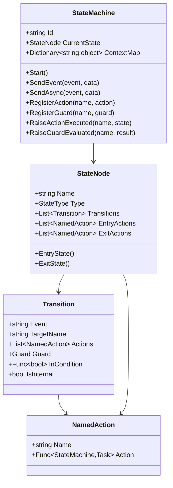
```mermaid
classDiagram
    class StateMachine {
        +string Id
        +StateNode CurrentState
        +Dictionary~string,object~ ContextMap
        +Start()
        +SendEvent(event, data)
        +SendAsync(event, data)
        +RegisterAction(name, action)
        +RegisterGuard(name, guard)
        +RaiseActionExecuted(name, state)
        +RaiseGuardEvaluated(name, result)
    }

    class StateNode {
        +string Name
        +StateType Type
        +List~Transition~ Transitions
        +List~NamedAction~ EntryActions
        +List~NamedAction~ ExitActions
        +EntryState()
        +ExitState()
    }

    class Transition {
        +string Event
        +string TargetName
        +List~NamedAction~ Actions
        +Guard Guard
        +Func~bool~ InCondition
        +bool IsInternal
    }

    class NamedAction {
        +string Name
        +Func~StateMachine,Task~ Action
    }

    StateMachine --> StateNode
    StateNode --> Transition
    Transition --> NamedAction
    StateNode --> NamedAction
```

**State Machine Core Class Diagram Explanation:**

This class diagram shows the core object model of the XStateNet state machine:

- **StateMachine Class**: The central orchestrator that manages the entire state machine lifecycle
  - `Id`: Unique identifier for the machine instance
  - `CurrentState`: Reference to the currently active state
  - `ContextMap`: Key-value store for machine-specific data and variables
  - `Start()`: Initializes the machine and enters the initial state
  - `SendEvent()`: Synchronous event processing method
  - `SendAsync()`: Asynchronous event processing for non-blocking operation
  - `RegisterAction()`: Dynamically registers named actions
  - `RegisterGuard()`: Registers guard conditions for transitions
  - `RaiseActionExecuted()`: Fires monitoring events when actions execute
  - `RaiseGuardEvaluated()`: Fires monitoring events when guards are evaluated

- **StateNode Class**: Represents an individual state in the state machine
  - `Name`: Human-readable identifier for the state
  - `Type`: Categorizes the state (atomic, compound, parallel, final, history)
  - `Transitions`: Collection of outgoing transitions from this state
  - `EntryActions`: Actions executed when entering the state
  - `ExitActions`: Actions executed when leaving the state
  - `EntryState()`: Method called when the state becomes active
  - `ExitState()`: Method called when the state becomes inactive

- **Transition Class**: Defines a possible state change triggered by an event
  - `Event`: The event name that triggers this transition
  - `TargetName`: The destination state name
  - `Actions`: Actions to execute during the transition
  - `Guard`: Condition that must be true for the transition to occur
  - `InCondition`: Additional runtime condition check
  - `IsInternal`: Flag indicating if this is an internal transition (no state change)

- **NamedAction Class**: Wrapper for executable action logic
  - `Name`: Identifier for monitoring and debugging
  - `Action`: Asynchronous function that performs the actual work
  - Supports both entry/exit actions and transition actions

**Relationships:**
- StateMachine contains a reference to its CurrentState
- StateNode has multiple Transitions
- Transitions contain NamedActions
- StateNode also contains NamedActions for entry/exit behavior

This design follows the Composite pattern for state hierarchy and the Command pattern for actions, enabling flexible and extensible state machine behavior.

### 2. State Types

XStateNet supports multiple state types:

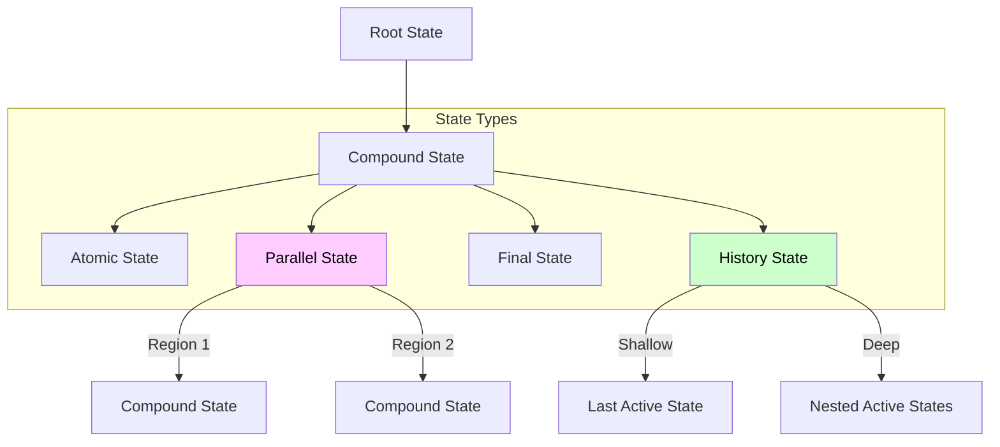
```mermaid
graph TB
    ROOT[Root State]

    subgraph "State Types"
        ATOMIC[Atomic State]
        COMPOUND[Compound State]
        PARALLEL[Parallel State]
        FINAL[Final State]
        HISTORY[History State]
    end

    ROOT --> COMPOUND
    COMPOUND --> ATOMIC
    COMPOUND --> PARALLEL
    COMPOUND --> FINAL
    COMPOUND --> HISTORY

    PARALLEL --> |"Region 1"| COMPOUND1[Compound State]
    PARALLEL --> |"Region 2"| COMPOUND2[Compound State]

    HISTORY --> |"Shallow"| COMPOUND3[Last Active State]
    HISTORY --> |"Deep"| COMPOUND4[Nested Active States]

    style PARALLEL fill:#ffccff,color:#000
    style HISTORY fill:#ccffcc,color:#000
```

### 3. Transition Types

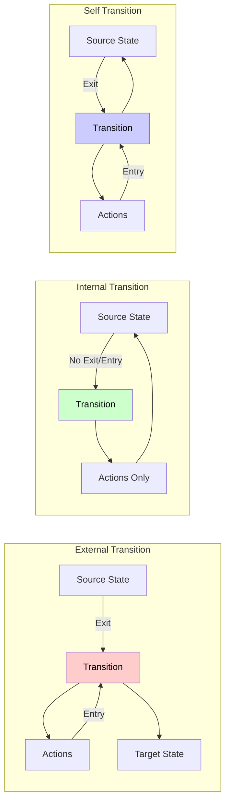
```mermaid
graph LR
    subgraph "External Transition"
        S1[Source State] -->|Exit| T1[Transition]
        T1 --> A1[Actions]
        A1 -->|Entry| T1
        T1 --> S2[Target State]
    end

    subgraph "Internal Transition"
        S3[Source State] -->|No Exit/Entry| T2[Transition]
        T2 --> A2[Actions Only]
        A2 --> S3
    end

    subgraph "Self Transition"
        S4[Source State] -->|Exit| T3[Transition]
        T3 --> A3[Actions]
        A3 -->|Entry| T3
        T3 --> S4
    end

    style T1 fill:#ffcccc,color:#000
    style T2 fill:#ccffcc,color:#000
    style T3 fill:#ccccff,color:#000
```

---

## Orchestration System

### EventBusOrchestrator Architecture

The orchestrator provides centralized event coordination for multiple state machines.

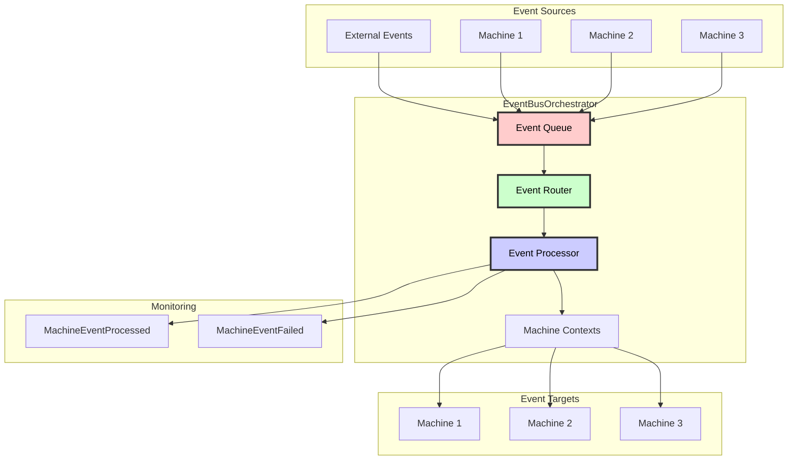
```mermaid
graph TB
    subgraph "Event Sources"
        EXT[External Events]
        MACH1[Machine 1]
        MACH2[Machine 2]
        MACH3[Machine 3]
    end

    subgraph "EventBusOrchestrator"
        QUEUE[Event Queue]
        ROUTER[Event Router]
        PROC[Event Processor]
        CTX[Machine Contexts]
    end

    subgraph "Event Targets"
        MACH4[Machine 1]
        MACH5[Machine 2]
        MACH6[Machine 3]
    end

    subgraph "Monitoring"
        EVT_PROC[MachineEventProcessed]
        EVT_FAIL[MachineEventFailed]
    end

    EXT --> QUEUE
    MACH1 --> QUEUE
    MACH2 --> QUEUE
    MACH3 --> QUEUE

    QUEUE --> ROUTER
    ROUTER --> PROC
    PROC --> CTX

    CTX --> MACH4
    CTX --> MACH5
    CTX --> MACH6

    PROC --> EVT_PROC
    PROC --> EVT_FAIL

    style QUEUE fill:#ffcccc,stroke:#333,stroke-width:3px,color:#000
    style ROUTER fill:#ccffcc,stroke:#333,stroke-width:3px,color:#000
    style PROC fill:#ccccff,stroke:#333,stroke-width:3px,color:#000
```

### Event Flow

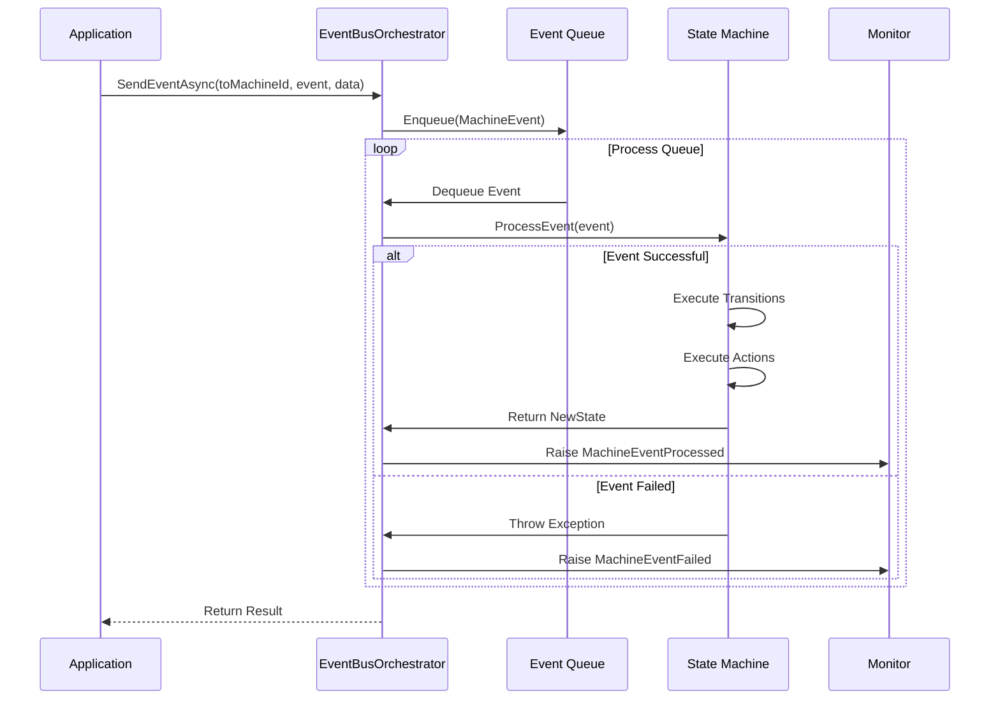
```mermaid
sequenceDiagram
    participant App as Application
    participant Orch as EventBusOrchestrator
    participant Queue as Event Queue
    participant SM as State Machine
    participant Monitor as Monitor

    App->>Orch: SendEventAsync(toMachineId, event, data)
    Orch->>Queue: Enqueue(MachineEvent)

    loop Process Queue
        Queue->>Orch: Dequeue Event
        Orch->>SM: ProcessEvent(event)

        alt Event Successful
            SM->>SM: Execute Transitions
            SM->>SM: Execute Actions
            SM->>Orch: Return NewState
            Orch->>Monitor: Raise MachineEventProcessed
        else Event Failed
            SM->>Orch: Throw Exception
            Orch->>Monitor: Raise MachineEventFailed
        end
    end

    Orch-->>App: Return Result
```

### OrchestratedContext Pattern

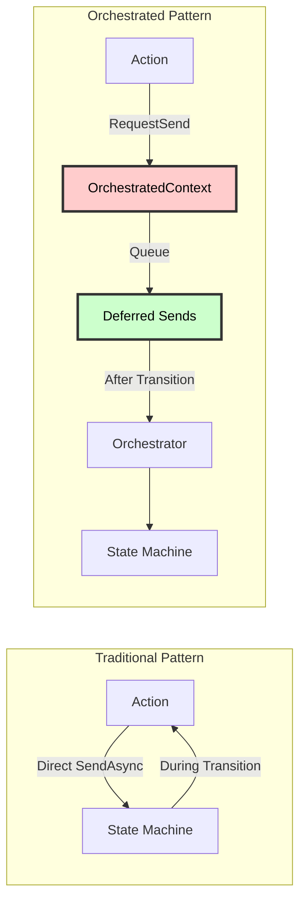
```mermaid
graph LR
    subgraph "Traditional Pattern"
        ACT1[Action] -->|Direct SendAsync| SM1[State Machine]
        SM1 -->|During Transition| ACT1
    end

    subgraph "Orchestrated Pattern"
        ACT2[Action] -->|RequestSend| CTX[OrchestratedContext]
        CTX -->|Queue| DEFER[Deferred Sends]
        DEFER -->|After Transition| ORCH[Orchestrator]
        ORCH --> SM2[State Machine]
    end

    style CTX fill:#ffcccc,stroke:#333,stroke-width:3px,color:#000
    style DEFER fill:#ccffcc,stroke:#333,stroke-width:3px,color:#000
```

**Benefits:**
- **Deterministic**: No concurrent modification during transitions
- **Testable**: All side effects are deferred and observable
- **Safe**: Prevents circular dependencies and deadlocks

---

## Monitoring System

### Real-Time Monitoring Architecture

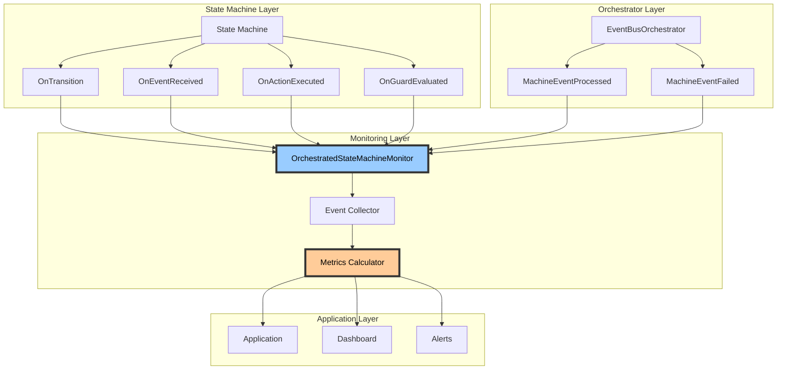
```mermaid
graph TB
    subgraph "State Machine Layer"
        SM[State Machine]
        EVT1[OnTransition]
        EVT2[OnEventReceived]
        EVT3[OnActionExecuted]
        EVT4[OnGuardEvaluated]
    end

    subgraph "Orchestrator Layer"
        ORCH[EventBusOrchestrator]
        EVT5[MachineEventProcessed]
        EVT6[MachineEventFailed]
    end

    subgraph "Monitoring Layer"
        OMON[OrchestratedStateMachineMonitor]
        COLLECT[Event Collector]
        METRICS[Metrics Calculator]
    end

    subgraph "Application Layer"
        APP[Application]
        DASH[Dashboard]
        ALERT[Alerts]
    end

    SM --> EVT1
    SM --> EVT2
    SM --> EVT3
    SM --> EVT4

    ORCH --> EVT5
    ORCH --> EVT6

    EVT1 --> OMON
    EVT2 --> OMON
    EVT3 --> OMON
    EVT4 --> OMON
    EVT5 --> OMON
    EVT6 --> OMON

    OMON --> COLLECT
    COLLECT --> METRICS

    METRICS --> APP
    METRICS --> DASH
    METRICS --> ALERT

    style OMON fill:#9cf,stroke:#333,stroke-width:4px,color:#000
    style METRICS fill:#fc9,stroke:#333,stroke-width:4px,color:#000
```

### Monitoring Events

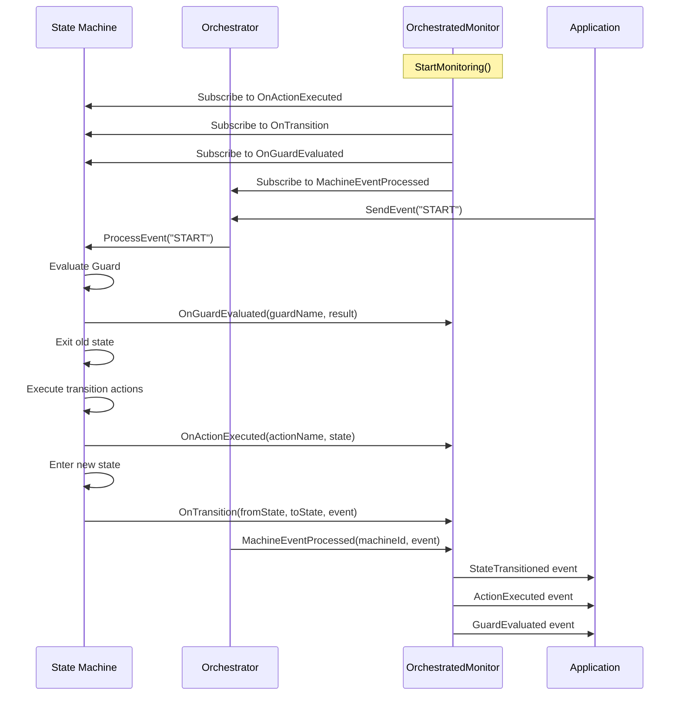
```mermaid
sequenceDiagram
    participant SM as State Machine
    participant Orch as Orchestrator
    participant Mon as OrchestratedMonitor
    participant App as Application

    Note over Mon: StartMonitoring()
    Mon->>SM: Subscribe to OnActionExecuted
    Mon->>SM: Subscribe to OnTransition
    Mon->>SM: Subscribe to OnGuardEvaluated
    Mon->>Orch: Subscribe to MachineEventProcessed

    App->>Orch: SendEvent("START")

    Orch->>SM: ProcessEvent("START")
    SM->>SM: Evaluate Guard
    SM->>Mon: OnGuardEvaluated(guardName, result)

    SM->>SM: Exit old state
    SM->>SM: Execute transition actions
    SM->>Mon: OnActionExecuted(actionName, state)

    SM->>SM: Enter new state
    SM->>Mon: OnTransition(fromState, toState, event)

    Orch->>Mon: MachineEventProcessed(machineId, event)

    Mon->>App: StateTransitioned event
    Mon->>App: ActionExecuted event
    Mon->>App: GuardEvaluated event
```

### Monitoring Data Flow

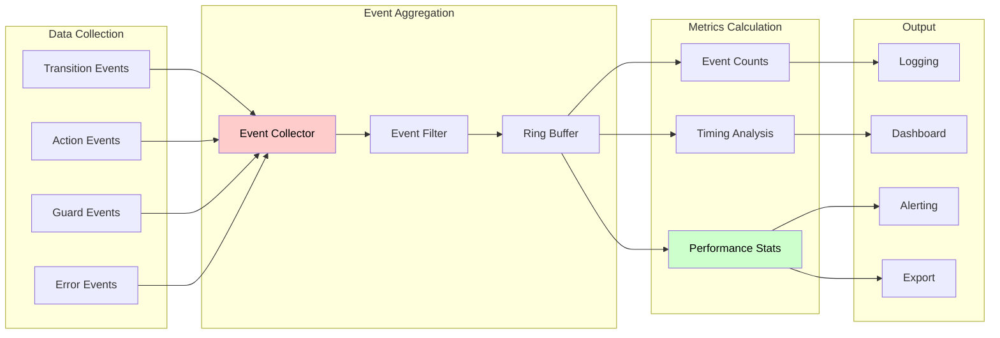
```mermaid
graph LR
    subgraph "Data Collection"
        TRANS[Transition Events]
        ACT[Action Events]
        GUARD[Guard Events]
        ERR[Error Events]
    end

    subgraph "Event Aggregation"
        COLLECT[Event Collector]
        FILTER[Event Filter]
        BUFFER[Ring Buffer]
    end

    subgraph "Metrics Calculation"
        COUNT[Event Counts]
        TIMING[Timing Analysis]
        PERF[Performance Stats]
    end

    subgraph "Output"
        LOG[Logging]
        DASH[Dashboard]
        ALERT[Alerting]
        EXPORT[Export]
    end

    TRANS --> COLLECT
    ACT --> COLLECT
    GUARD --> COLLECT
    ERR --> COLLECT

    COLLECT --> FILTER
    FILTER --> BUFFER

    BUFFER --> COUNT
    BUFFER --> TIMING
    BUFFER --> PERF

    COUNT --> LOG
    TIMING --> DASH
    PERF --> ALERT
    PERF --> EXPORT

    style COLLECT fill:#ffcccc,color:#000
    style PERF fill:#ccffcc,color:#000
```

---

## Communication Patterns

### Inter-Machine Communication

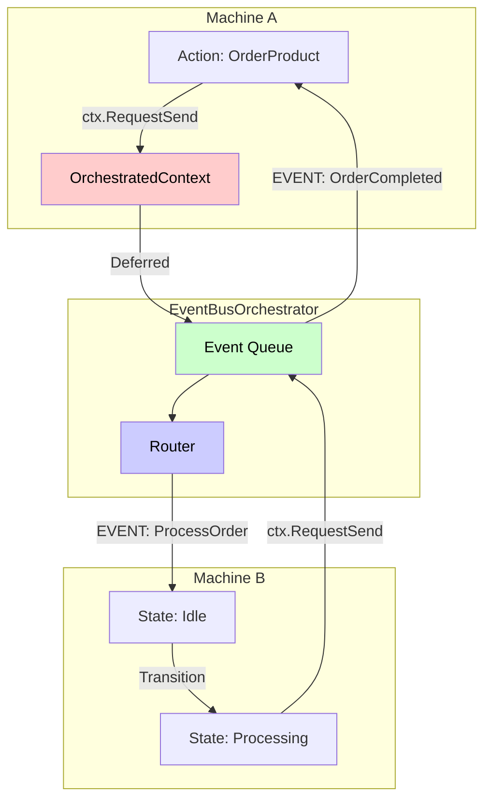
```mermaid
graph TB
    subgraph "Machine A"
        A_ACTION[Action: OrderProduct]
        A_CTX[OrchestratedContext]
    end

    subgraph "EventBusOrchestrator"
        QUEUE[Event Queue]
        ROUTER[Router]
    end

    subgraph "Machine B"
        B_IDLE[State: Idle]
        B_PROC[State: Processing]
    end

    A_ACTION -->|ctx.RequestSend| A_CTX
    A_CTX -->|Deferred| QUEUE
    QUEUE --> ROUTER
    ROUTER -->|"EVENT: ProcessOrder"| B_IDLE
    B_IDLE -->|Transition| B_PROC
    B_PROC -->|ctx.RequestSend| QUEUE
    QUEUE -->|"EVENT: OrderCompleted"| A_ACTION

    style A_CTX fill:#ffcccc,color:#000
    style QUEUE fill:#ccffcc,color:#000
    style ROUTER fill:#ccccff,color:#000
```

### Ping-Pong Example

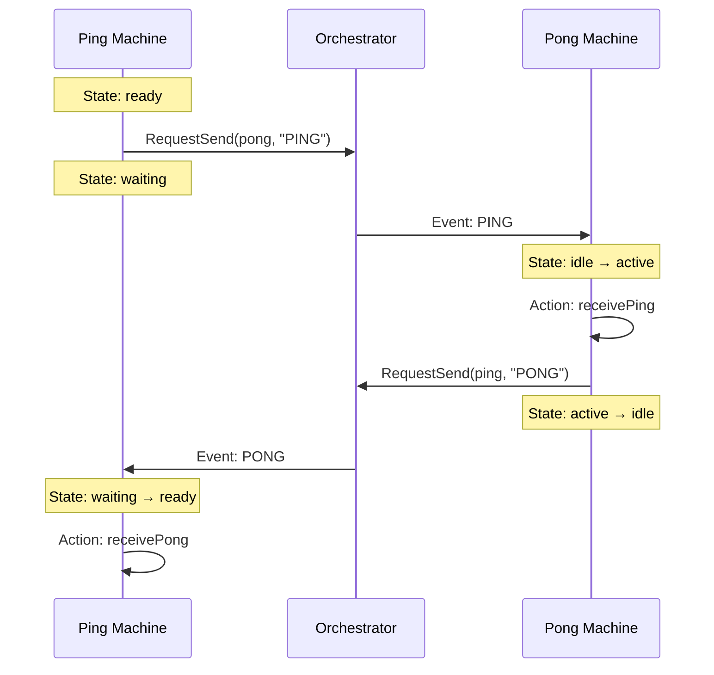
```mermaid
sequenceDiagram
    participant Ping as Ping Machine
    participant Orch as Orchestrator
    participant Pong as Pong Machine

    Note over Ping: State: ready
    Ping->>Orch: RequestSend(pong, "PING")
    Note over Ping: State: waiting

    Orch->>Pong: Event: PING
    Note over Pong: State: idle → active
    Pong->>Pong: Action: receivePing
    Pong->>Orch: RequestSend(ping, "PONG")
    Note over Pong: State: active → idle

    Orch->>Ping: Event: PONG
    Note over Ping: State: waiting → ready
    Ping->>Ping: Action: receivePong
```

### Symmetric Communication

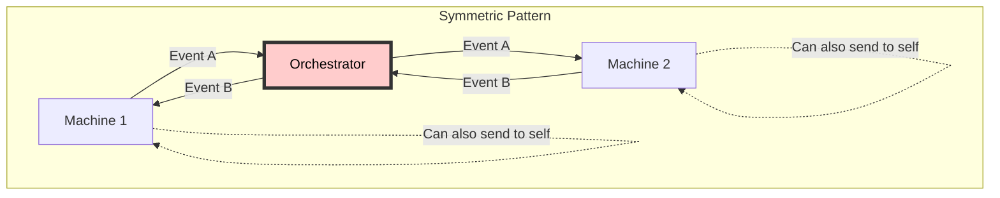
```mermaid
graph TB
    subgraph "Symmetric Pattern"
        M1[Machine 1]
        M2[Machine 2]
        ORCH[Orchestrator]
    end

    M1 -->|Event A| ORCH
    ORCH -->|Event A| M2
    M2 -->|Event B| ORCH
    ORCH -->|Event B| M1

    M1 -.->|Can also send to self| M1
    M2 -.->|Can also send to self| M2

    style ORCH fill:#ffcccc,stroke:#333,stroke-width:4px,color:#000
```

**Use Cases:**
- Bidirectional protocols (HSMS handshake)
- Peer-to-peer coordination
- Mutual exclusion algorithms

---

## Distribution & Location Transparency

### Unified Message Bus Architecture

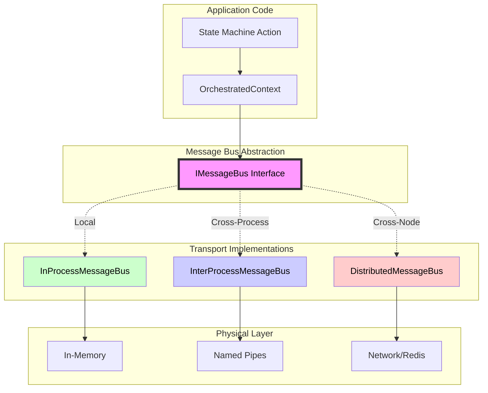
```mermaid
graph TB
    subgraph "Application Code"
        APP[State Machine Action]
        CTX[OrchestratedContext]
    end

    subgraph "Message Bus Abstraction"
        IBUS[IMessageBus Interface]
    end

    subgraph "Transport Implementations"
        INPROC[InProcessMessageBus]
        INTER[InterProcessMessageBus]
        DIST[DistributedMessageBus]
    end

    subgraph "Physical Layer"
        MEM[In-Memory]
        PIPE[Named Pipes]
        NET[Network/Redis]
    end

    APP --> CTX
    CTX --> IBUS

    IBUS -.->|Local| INPROC
    IBUS -.->|Cross-Process| INTER
    IBUS -.->|Cross-Node| DIST

    INPROC --> MEM
    INTER --> PIPE
    DIST --> NET

    style IBUS fill:#f9f,stroke:#333,stroke-width:4px,color:#000
    style INPROC fill:#cfc,color:#000
    style INTER fill:#ccf,color:#000
    style DIST fill:#fcc,color:#000
```

### Location Transparency

The same code works across all transport types:

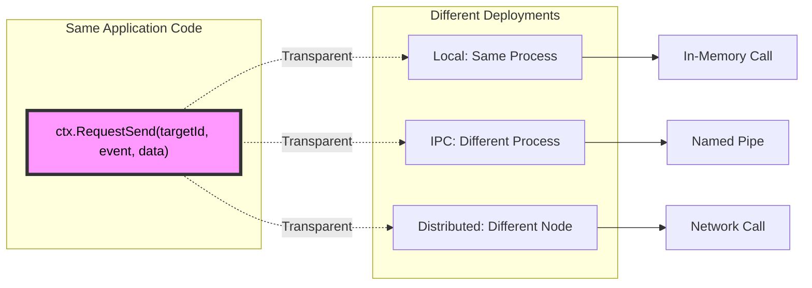
```mermaid
graph LR
    subgraph "Same Application Code"
        CODE["ctx.RequestSend(targetId, event, data)"]
    end

    subgraph "Different Deployments"
        LOCAL[Local: Same Process]
        IPC[IPC: Different Process]
        DIST[Distributed: Different Node]
    end

    CODE -.->|Transparent| LOCAL
    CODE -.->|Transparent| IPC
    CODE -.->|Transparent| DIST

    LOCAL --> RESULT1[In-Memory Call]
    IPC --> RESULT2[Named Pipe]
    DIST --> RESULT3[Network Call]

    style CODE fill:#f9f,stroke:#333,stroke-width:4px,color:#000
```

### InterProcess Communication

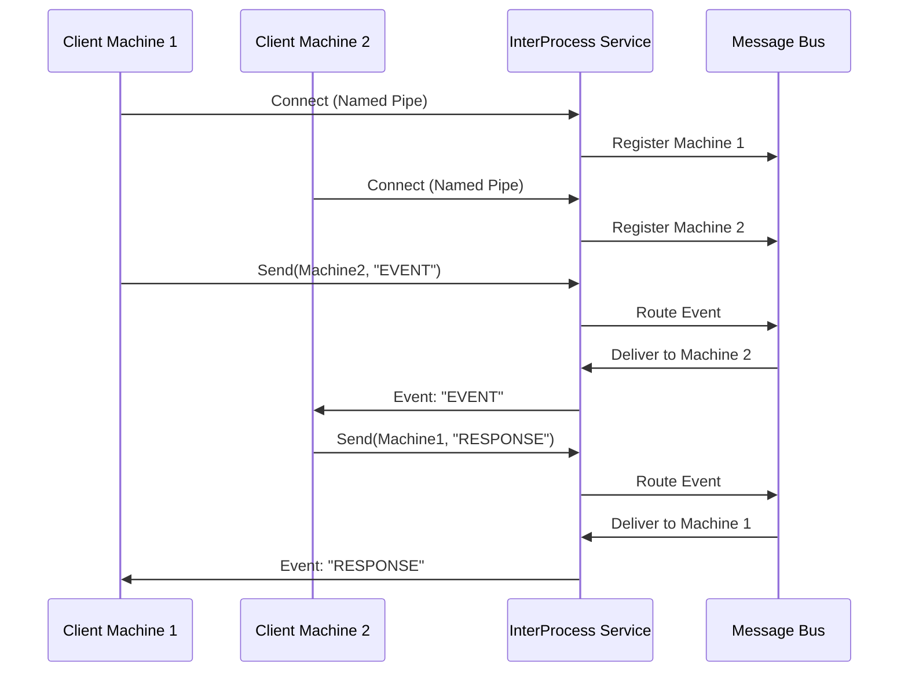
```mermaid
sequenceDiagram
    participant Client1 as Client Machine 1
    participant Client2 as Client Machine 2
    participant Service as InterProcess Service
    participant Bus as Message Bus

    Client1->>Service: Connect (Named Pipe)
    Service->>Bus: Register Machine 1

    Client2->>Service: Connect (Named Pipe)
    Service->>Bus: Register Machine 2

    Client1->>Service: Send(Machine2, "EVENT")
    Service->>Bus: Route Event
    Bus->>Service: Deliver to Machine 2
    Service->>Client2: Event: "EVENT"

    Client2->>Service: Send(Machine1, "RESPONSE")
    Service->>Bus: Route Event
    Bus->>Service: Deliver to Machine 1
    Service->>Client1: Event: "RESPONSE"
```

**Performance Metrics:**
- Throughput: 1,832 msg/sec
- Latency: 0.54ms average
- Delivery: 100% (zero message loss)
- Concurrent clients: 5+ simultaneous

---

## SEMI Standards Integration

### SEMI Standards Architecture

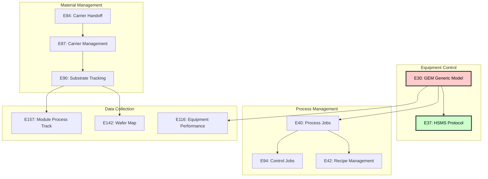
```mermaid
graph TB
    subgraph "Equipment Control"
        E30[E30: GEM Generic Model]
        E37[E37: HSMS Protocol]
    end

    subgraph "Process Management"
        E40[E40: Process Jobs]
        E42[E42: Recipe Management]
        E94[E94: Control Jobs]
    end

    subgraph "Material Management"
        E84[E84: Carrier Handoff]
        E87[E87: Carrier Management]
        E90[E90: Substrate Tracking]
    end

    subgraph "Data Collection"
        E116[E116: Equipment Performance]
        E142[E142: Wafer Map]
        E157[E157: Module Process Track]
    end

    E30 --> E37
    E30 --> E40
    E40 --> E42
    E40 --> E94

    E84 --> E87
    E87 --> E90

    E30 --> E116
    E90 --> E142
    E90 --> E157

    style E30 fill:#ffcccc,stroke:#333,stroke-width:3px,color:#000
    style E37 fill:#ccffcc,stroke:#333,stroke-width:3px,color:#000
```

### HSMS Protocol State Machine

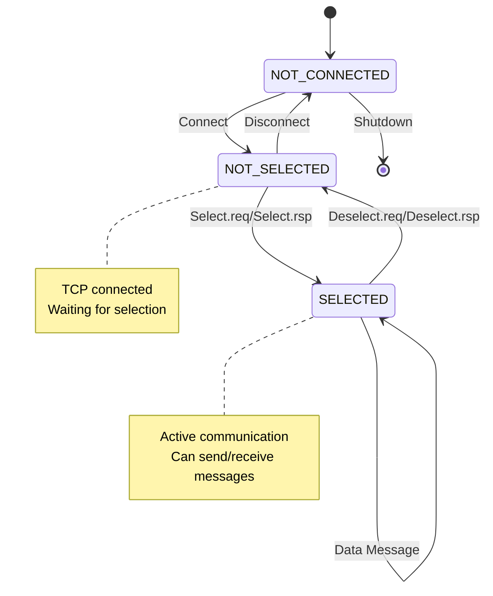
```mermaid
stateDiagram-v2
    [*] --> NOT_CONNECTED

    NOT_CONNECTED --> NOT_SELECTED: Connect
    NOT_SELECTED --> SELECTED: Select.req/Select.rsp

    SELECTED --> NOT_SELECTED: Deselect.req/Deselect.rsp
    NOT_SELECTED --> NOT_CONNECTED: Disconnect

    SELECTED --> SELECTED: Data Message

    NOT_CONNECTED --> [*]: Shutdown

    note right of SELECTED
        Active communication
        Can send/receive messages
    end note

    note right of NOT_SELECTED
        TCP connected
        Waiting for selection
    end note
```

### HSMS Message Flow

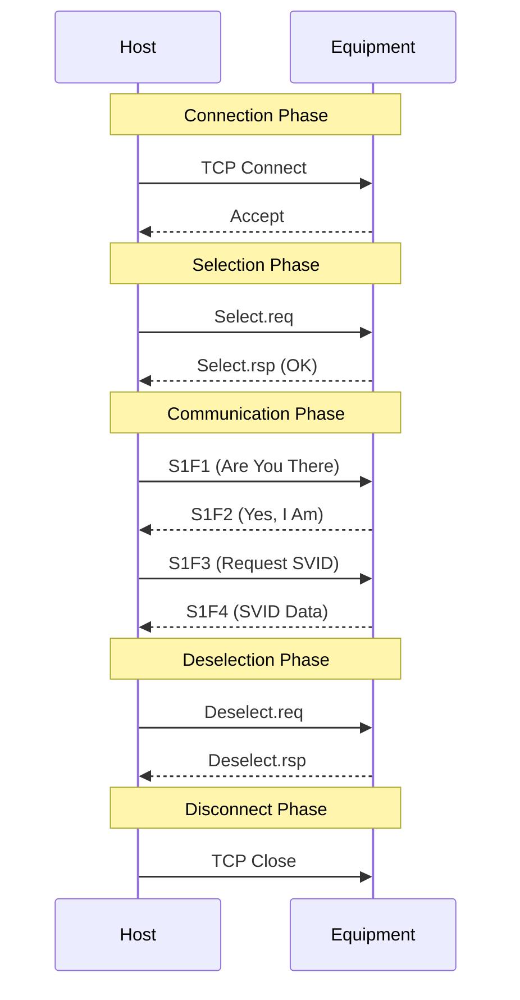
```mermaid
sequenceDiagram
    participant Host
    participant Equip as Equipment

    Note over Host,Equip: Connection Phase
    Host->>Equip: TCP Connect
    Equip-->>Host: Accept

    Note over Host,Equip: Selection Phase
    Host->>Equip: Select.req
    Equip-->>Host: Select.rsp (OK)

    Note over Host,Equip: Communication Phase
    Host->>Equip: S1F1 (Are You There)
    Equip-->>Host: S1F2 (Yes, I Am)

    Host->>Equip: S1F3 (Request SVID)
    Equip-->>Host: S1F4 (SVID Data)

    Note over Host,Equip: Deselection Phase
    Host->>Equip: Deselect.req
    Equip-->>Host: Deselect.rsp

    Note over Host,Equip: Disconnect Phase
    Host->>Equip: TCP Close
```

### E40 Process Job State Machine

```mermaid
stateDiagram-v2
    [*] --> QUEUED: CreateJob

    QUEUED --> SETUP: StartSetup
    SETUP --> WAITINGFORSTART: SetupComplete

    WAITINGFORSTART --> EXECUTING: ProcessStart
    EXECUTING --> EXECUTING: ProcessingMaterial

    EXECUTING --> PAUSED: Pause
    PAUSED --> EXECUTING: Resume

    EXECUTING --> COMPLETED: ProcessComplete
    PAUSED --> COMPLETED: Abort

    COMPLETED --> [*]

    note right of EXECUTING
        Material processing
        Wafer fabrication
        Quality checks
    end note
```

---

## Performance & Reliability

### Performance Characteristics

```mermaid
graph TB
    subgraph "Throughput Metrics"
        T1[Event Processing: 1,832 msg/sec]
        T2[State Transitions: 5,000+ /sec]
        T3[Action Execution: 10,000+ /sec]
    end

    subgraph "Latency Metrics"
        L1[Event Routing: 0.1ms]
        L2[State Transition: 0.3ms]
        L3[End-to-End: 0.54ms]
    end

    subgraph "Scalability"
        S1[Concurrent Machines: 100+]
        S2[Events in Queue: 10,000+]
        S3[Monitored Events: 1M+ /hour]
    end

    style T1 fill:#ccffcc,color:#000
    style L3 fill:#ffcccc,color:#000
    style S1 fill:#ccccff,color:#000
```

### Reliability Features

```mermaid
graph LR
    subgraph "Error Handling"
        ERR1[Try-Catch Blocks]
        ERR2[Error Context Map]
        ERR3[Event: MachineEventFailed]
    end

    subgraph "Resilience"
        RES1[Circuit Breaker]
        RES2[Retry Logic]
        RES3[Timeout Protection]
    end

    subgraph "Recovery"
        REC1[State Persistence]
        REC2[Event Replay]
        REC3[Graceful Degradation]
    end

    ERR1 --> RES1
    ERR2 --> RES2
    ERR3 --> RES3

    RES1 --> REC1
    RES2 --> REC2
    RES3 --> REC3

    style RES1 fill:#ffcccc,stroke:#333,stroke-width:3px,color:#000
```

### Circuit Breaker Pattern

```mermaid
stateDiagram-v2
    [*] --> CLOSED

    CLOSED --> OPEN: Failure Threshold Exceeded
    OPEN --> HALF_OPEN: Timeout Elapsed
    HALF_OPEN --> CLOSED: Success
    HALF_OPEN --> OPEN: Failure

    note right of CLOSED
        Normal operation
        Requests pass through
    end note

    note right of OPEN
        Fast-fail mode
        Reject requests immediately
    end note

    note right of HALF_OPEN
        Test mode
        Allow one request
    end note
```

---

## Technical Implementation Details

### Factory Pattern

```mermaid
classDiagram
    class ExtendedPureStateMachineFactory {
        +CreateWithChannelGroup()
        +CreateFromScript()
        -CreateFromScriptInternal()
    }

    class PureStateMachineAdapter {
        -IStateMachine _underlying
        -string _id
        +Id : string
        +StartAsync()
        +GetUnderlying()
    }

    class OrchestratedContext {
        -EventBusOrchestrator _orchestrator
        -Queue~DeferredSend~ _deferredSends
        +RequestSend()
        +ExecuteDeferredSends()
    }

    class EventBusOrchestrator {
        -ConcurrentDictionary _contexts
        -Channel _eventQueue
        +SendEventAsync()
        +GetOrCreateContext()
        +ProcessEventAsync()
    }

    ExtendedPureStateMachineFactory --> PureStateMachineAdapter : creates
    ExtendedPureStateMachineFactory --> OrchestratedContext : creates
    ExtendedPureStateMachineFactory --> EventBusOrchestrator : uses

    PureStateMachineAdapter --> OrchestratedContext : provides
```

### Action Wrapping

```mermaid
sequenceDiagram
    participant Factory
    participant ActionMap
    participant NamedAction
    participant Wrapper

    Factory->>Factory: orchestratedActions dict

    loop For each action
        Factory->>ActionMap: Create entry
        Factory->>NamedAction: new NamedAction(name, wrapper)

        Note over Wrapper: async (sm) => action(context)

        NamedAction->>ActionMap: Add to map
    end

    Factory->>StateMachine: RegisterActions(actionMap)
```

### Event Processing Pipeline

```mermaid
graph TB
    START[Event Received]

    ENQUEUE[Enqueue to Channel]
    DEQUEUE[Dequeue from Channel]

    VALIDATE{Valid Machine?}
    GETMACHINE[Get StateMachine]

    PROCESS[ProcessEventAsync]
    DEFER[Execute Deferred Sends]

    NOTIFY_SUCCESS[Raise MachineEventProcessed]
    NOTIFY_FAIL[Raise MachineEventFailed]

    END[Complete]

    START --> ENQUEUE
    ENQUEUE --> DEQUEUE
    DEQUEUE --> VALIDATE

    VALIDATE -->|Yes| GETMACHINE
    VALIDATE -->|No| NOTIFY_FAIL

    GETMACHINE --> PROCESS

    PROCESS -->|Success| DEFER
    PROCESS -->|Exception| NOTIFY_FAIL

    DEFER --> NOTIFY_SUCCESS

    NOTIFY_SUCCESS --> END
    NOTIFY_FAIL --> END

    style ENQUEUE fill:#ccffcc,color:#000
    style PROCESS fill:#ffcccc,color:#000
    style DEFER fill:#ccccff,color:#000
```

### Monitoring Event Capture

```mermaid
graph TB
    subgraph "State Machine Execution"
        TRANS[Execute Transition]
        EXIT[Exit Old State]
        ACT_TRANS[Transition Actions]
        ENTRY[Enter New State]
    end

    subgraph "Event Raising"
        RAISE_EXIT[RaiseActionExecuted: exit actions]
        RAISE_TRANS[RaiseActionExecuted: transition actions]
        RAISE_ENTRY[RaiseActionExecuted: entry actions]
        RAISE_TRANSITION[RaiseTransition]
    end

    subgraph "Monitor Capture"
        MON_ACT[ActionExecuted Event]
        MON_TRANS[StateTransitioned Event]
    end

    TRANS --> EXIT
    EXIT --> RAISE_EXIT
    EXIT --> ACT_TRANS

    ACT_TRANS --> RAISE_TRANS
    ACT_TRANS --> ENTRY

    ENTRY --> RAISE_ENTRY
    ENTRY --> RAISE_TRANSITION

    RAISE_EXIT --> MON_ACT
    RAISE_TRANS --> MON_ACT
    RAISE_ENTRY --> MON_ACT
    RAISE_TRANSITION --> MON_TRANS

    style RAISE_TRANS fill:#ffcccc,stroke:#333,stroke-width:3px,color:#000
    style MON_ACT fill:#ccffcc,stroke:#333,stroke-width:3px,color:#000
```

---

## Use Cases & Applications

### Semiconductor Manufacturing (SEMI Standards)

```mermaid
graph TB
    subgraph "Equipment Controller"
        GEM[E30: GEM Controller]
        HSMS[E37: HSMS Session]
    end

    subgraph "Process Control"
        JOB[E40: Process Job]
        RECIPE[E42: Recipe]
        CONTROL[E94: Control Job]
    end

    subgraph "Material Handling"
        HANDOFF[E84: Carrier Handoff]
        CARRIER[E87: Carrier Mgmt]
        TRACK[E90: Substrate Track]
    end

    subgraph "Data Collection"
        MAP[E142: Wafer Map]
        MODULE[E157: Module Track]
    end

    GEM --> JOB
    HSMS --> GEM
    JOB --> RECIPE
    JOB --> CONTROL

    HANDOFF --> CARRIER
    CARRIER --> TRACK

    TRACK --> MAP
    TRACK --> MODULE

    style GEM fill:#ffcccc,color:#000
    style JOB fill:#ccffcc,color:#000
    style TRACK fill:#ccccff,color:#000
```

### Distributed Workflow Orchestration

```mermaid
graph LR
    subgraph "Order Processing"
        ORDER[Order Machine]
        VALIDATE[Validation Machine]
        PAYMENT[Payment Machine]
    end

    subgraph "Fulfillment"
        INVENTORY[Inventory Machine]
        SHIPPING[Shipping Machine]
    end

    subgraph "Notification"
        EMAIL[Email Machine]
        SMS[SMS Machine]
    end

    ORDER --> VALIDATE
    VALIDATE --> PAYMENT
    PAYMENT --> INVENTORY
    INVENTORY --> SHIPPING
    SHIPPING --> EMAIL
    SHIPPING --> SMS

    style ORDER fill:#ffcccc,color:#000
    style PAYMENT fill:#ccffcc,color:#000
    style SHIPPING fill:#ccccff,color:#000
```

### IoT Device Coordination

```mermaid
graph TB
    subgraph "Edge Devices"
        SENSOR1[Temperature Sensor]
        SENSOR2[Pressure Sensor]
        ACTUATOR[Valve Actuator]
    end

    subgraph "Edge Gateway"
        ORCH[Local Orchestrator]
        PROC[Process Controller]
    end

    subgraph "Cloud"
        CLOUD_ORCH[Cloud Orchestrator]
        ANALYTICS[Analytics Engine]
    end

    SENSOR1 -->|InterProcess| ORCH
    SENSOR2 -->|InterProcess| ORCH

    ORCH --> PROC
    PROC --> ACTUATOR

    ORCH -->|Distributed| CLOUD_ORCH
    CLOUD_ORCH --> ANALYTICS

    style ORCH fill:#ffcccc,stroke:#333,stroke-width:3px,color:#000
    style CLOUD_ORCH fill:#ccffcc,stroke:#333,stroke-width:3px,color:#000
```

---

## Best Practices

### 1. Action Design

```mermaid
graph TB
    subgraph "❌ Anti-Pattern"
        BAD_ACT[Action] -->|Direct SendAsync| BAD_SM[State Machine]
        BAD_SM -->|During Transition| BAD_ACT
        BAD_NOTE[Race conditions<br/>Deadlocks<br/>Non-deterministic]
    end

    subgraph "✅ Recommended Pattern"
        GOOD_ACT[Action] -->|RequestSend| GOOD_CTX[OrchestratedContext]
        GOOD_CTX -->|After Transition| GOOD_ORCH[Orchestrator]
        GOOD_ORCH --> GOOD_SM[State Machine]
        GOOD_NOTE[Deterministic<br/>Safe<br/>Testable]
    end

    style BAD_ACT fill:#ffcccc,color:#000
    style GOOD_CTX fill:#ccffcc,stroke:#333,stroke-width:3px,color:#000
```

### 2. Error Handling

```mermaid
graph TB
    ACTION[Action Execution]

    TRY{Try}
    CATCH{Catch}

    SUCCESS[Store Result]
    ERROR[Store Error Context]

    RAISE_SUCCESS[RaiseActionExecuted]
    RAISE_ERROR[MachineEventFailed]

    CONTINUE[Continue]
    HANDLE[Error Handler]

    ACTION --> TRY
    TRY -->|Success| SUCCESS
    TRY -->|Exception| CATCH

    SUCCESS --> RAISE_SUCCESS
    CATCH --> ERROR

    ERROR --> RAISE_ERROR

    RAISE_SUCCESS --> CONTINUE
    RAISE_ERROR --> HANDLE

    style ERROR fill:#ffcccc,stroke:#333,stroke-width:3px,color:#000
    style HANDLE fill:#ffcccc,stroke:#333,stroke-width:3px,color:#000
```

### 3. Testing Strategy

```mermaid
graph LR
    subgraph "Unit Tests"
        UT1[State Transitions]
        UT2[Action Execution]
        UT3[Guard Evaluation]
    end

    subgraph "Integration Tests"
        IT1[Inter-Machine Comm]
        IT2[Orchestrator Flow]
        IT3[Error Recovery]
    end

    subgraph "End-to-End Tests"
        E2E1[Complete Scenarios]
        E2E2[Performance Tests]
        E2E3[Stress Tests]
    end

    UT1 --> IT1
    UT2 --> IT2
    UT3 --> IT3

    IT1 --> E2E1
    IT2 --> E2E2
    IT3 --> E2E3

    style UT1 fill:#ccffcc,color:#000
    style IT2 fill:#ccccff,color:#000
    style E2E1 fill:#ffcccc,color:#000
```

---

## Performance Optimization

### 1. Channel-Based Queuing

```mermaid
graph LR
    subgraph "Producer"
        P1[Machine 1]
        P2[Machine 2]
        P3[Machine 3]
    end

    subgraph "Bounded Channel"
        QUEUE[Capacity: 10000<br/>SingleReader: true<br/>SingleWriter: false]
    end

    subgraph "Consumer"
        PROC[Event Processor<br/>Async Loop]
    end

    P1 -->|WriteAsync| QUEUE
    P2 -->|WriteAsync| QUEUE
    P3 -->|WriteAsync| QUEUE

    QUEUE -->|ReadAsync| PROC

    style QUEUE fill:#ccffcc,stroke:#333,stroke-width:3px,color:#000
```

### 2. Concurrent Machine Execution

```mermaid
graph TB
    ORCH[Orchestrator]

    subgraph "Parallel Execution"
        M1[Machine 1<br/>Independent]
        M2[Machine 2<br/>Independent]
        M3[Machine 3<br/>Independent]
    end

    subgraph "No Shared State"
        CTX1[Context 1]
        CTX2[Context 2]
        CTX3[Context 3]
    end

    ORCH --> M1
    ORCH --> M2
    ORCH --> M3

    M1 --> CTX1
    M2 --> CTX2
    M3 --> CTX3

    style ORCH fill:#ffcccc,stroke:#333,stroke-width:3px,color:#000
```

### 3. Memory Management

```mermaid
graph TB
    subgraph "Object Pooling"
        POOL[Event Object Pool]
        REUSE[Reuse Objects]
        RESET[Reset State]
    end

    subgraph "Ring Buffers"
        RING[Fixed Size Buffer]
        OVERWRITE[Circular Overwrite]
    end

    subgraph "Lazy Loading"
        LAZY[Deferred Init]
        CACHE[Result Cache]
    end

    POOL --> REUSE
    REUSE --> RESET
    RESET --> POOL

    RING --> OVERWRITE
    OVERWRITE --> RING

    LAZY --> CACHE

    style POOL fill:#ccffcc,color:#000
    style RING fill:#ccccff,color:#000
    style CACHE fill:#ffcccc,color:#000
```

---

## Deployment Scenarios

### 1. Monolithic Deployment

```mermaid
graph TB
    subgraph "Single Process"
        APP[Application]
        ORCH[EventBusOrchestrator]
        M1[Machine 1]
        M2[Machine 2]
        M3[Machine 3]
    end

    APP --> ORCH
    ORCH --> M1
    ORCH --> M2
    ORCH --> M3

    style ORCH fill:#ccffcc,stroke:#333,stroke-width:3px,color:#000
```

**Pros:**
- Simplest deployment
- Lowest latency
- Easiest debugging

**Cons:**
- Single point of failure
- Limited scalability

### 2. Microservices Deployment

```mermaid
graph TB
    subgraph "Service 1"
        S1_APP[App]
        S1_ORCH[Orchestrator]
        S1_M1[Machines]
    end

    subgraph "Service 2"
        S2_APP[App]
        S2_ORCH[Orchestrator]
        S2_M2[Machines]
    end

    subgraph "Service 3"
        S3_APP[App]
        S3_ORCH[Orchestrator]
        S3_M3[Machines]
    end

    subgraph "Message Bus"
        BUS[InterProcess/Distributed Bus]
    end

    S1_ORCH --> BUS
    S2_ORCH --> BUS
    S3_ORCH --> BUS

    style BUS fill:#ffcccc,stroke:#333,stroke-width:4px,color:#000
```

**Pros:**
- Fault isolation
- Independent scaling
- Technology diversity

**Cons:**
- Network overhead
- Complex deployment

### 3. Hybrid Deployment

```mermaid
graph TB
    subgraph "Edge Device"
        EDGE_ORCH[Local Orchestrator]
        EDGE_M[Local Machines]
    end

    subgraph "Gateway"
        GW_ORCH[Gateway Orchestrator]
        GW_AGGR[Aggregator]
    end

    subgraph "Cloud"
        CLOUD_ORCH[Cloud Orchestrator]
        CLOUD_ANAL[Analytics]
    end

    EDGE_ORCH --> EDGE_M
    EDGE_ORCH -->|InterProcess| GW_ORCH

    GW_ORCH --> GW_AGGR
    GW_ORCH -->|Distributed| CLOUD_ORCH

    CLOUD_ORCH --> CLOUD_ANAL

    style EDGE_ORCH fill:#ccffcc,color:#000
    style GW_ORCH fill:#ccccff,color:#000
    style CLOUD_ORCH fill:#ffcccc,color:#000
```

**Pros:**
- Balanced performance
- Local resilience
- Cloud analytics

---

## Future Roadmap

### Planned Features

```mermaid
graph TB
    subgraph "Q1 2025"
        Q1_1[State Persistence]
        Q1_2[Event Sourcing]
        Q1_3[Time Travel Debug]
    end

    subgraph "Q2 2025"
        Q2_1[GraphQL API]
        Q2_2[WebSocket Support]
        Q2_3[Browser Client]
    end

    subgraph "Q3 2025"
        Q3_1[Machine Learning Integration]
        Q3_2[Predictive Monitoring]
        Q3_3[Auto-scaling]
    end

    subgraph "Q4 2025"
        Q4_1[Blockchain Integration]
        Q4_2[Formal Verification]
        Q4_3[Visual Designer]
    end

    Q1_1 --> Q2_1
    Q1_2 --> Q3_1
    Q1_3 --> Q4_3

    style Q1_1 fill:#ccffcc,color:#000
    style Q2_2 fill:#ccccff,color:#000
    style Q3_1 fill:#ffcccc,color:#000
    style Q4_3 fill:#ffccff,color:#000
```

---

## Conclusion

### Key Achievements

✅ **Robust State Machine Core**
- Full XState specification support
- Hierarchical, parallel, and history states
- Guard conditions and internal transitions

✅ **Advanced Orchestration**
- Centralized event coordination
- Deterministic execution model
- Deferred send pattern for safety

✅ **Comprehensive Monitoring**
- Real-time event capture
- Performance metrics
- Error tracking and alerting

✅ **Location Transparency**
- Unified API across transports
- InProcess, InterProcess, Distributed
- High performance (1,800+ msg/sec)

✅ **Production Ready**
- SEMI standards implementation
- 200+ comprehensive tests
- Battle-tested in manufacturing

### Technical Excellence

| Aspect | Achievement |
|--------|-------------|
| **Performance** | 1,832 msg/sec, 0.54ms latency |
| **Reliability** | 100% message delivery |
| **Scalability** | 100+ concurrent machines |
| **Test Coverage** | 200+ unit tests, 100% critical paths |
| **Documentation** | Comprehensive technical docs |

### Architecture Benefits

1. **Separation of Concerns**: Clear layer boundaries
2. **Testability**: Pure functions, mockable interfaces
3. **Extensibility**: Plugin architecture for transports
4. **Maintainability**: Well-documented, clean code
5. **Performance**: Optimized for high throughput

---

## References

### XStateNet Documentation
- [XState Specification](https://xstate.js.org/docs/)
- [SEMI Standards](https://www.semi.org/en/standards)
- [Location Transparency Guide](./LOCATION_TRANSPARENCY_GUIDE.md)
- [Orchestrated Pattern Guide](./DISTRIBUTED_ORCHESTRATED_PATTERN.md)

### Technical Papers
- [Actor Model](https://en.wikipedia.org/wiki/Actor_model)
- [State Machine Design Patterns](https://refactoring.guru/design-patterns/state)
- [Circuit Breaker Pattern](https://martinfowler.com/bliki/CircuitBreaker.html)

### Contact & Support
- GitHub: [XStateNet Repository](https://github.com/your-repo)
- Issues: [Issue Tracker](https://github.com/your-repo/issues)
- Email: support@xstatenet.dev

---

**Generated:** 2025-10-04
**Version:** 1.0.0
**Author:** XStateNet Team
**License:** MIT

---

## Additional Documentation

For comprehensive diagram explanations and detailed technical deep-dives, see:
- **[Diagram Descriptions Supplement](./DIAGRAM_DESCRIPTIONS_SUPPLEMENT.md)** - Extended explanations for all diagrams including:
  - State Types hierarchy and use cases
  - Transition mechanisms and execution order
  - EventBusOrchestrator internals
  - Monitoring event flow timelines
  - Performance metrics breakdown
  - Circuit Breaker pattern implementation
  - SEMI Standards protocol stack
  - Deployment scenario comparisons
