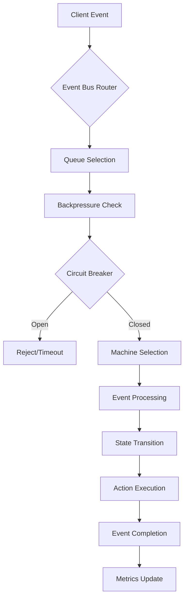

# XStateNet Architecture Guide

## 🏗️ System Overview

XStateNet is built on a layered, modular architecture that provides high-performance state machine execution while maintaining clean separation of concerns and extensibility.

## 🧱 Core Architecture Layers

### 1. State Machine Engine (Core Layer)
**Location**: `XStateNet5Impl/`

The foundation layer providing core state machine functionality:

- **State Management**: Hierarchical and parallel state handling
- **Event Processing**: High-throughput event processing engine
- **Transition Logic**: Guard evaluation and action execution
- **Memory Management**: Optimized object pooling and GC pressure reduction

#### Key Components

```csharp
// Core state machine implementation
StateMachine.cs              // Main state machine engine
State_Real.cs               // Concrete state implementations
State_Parallel.cs           // Parallel state coordination
Transition.cs               // Transition logic and guards
```

### 2. Orchestration Layer
**Location**: `XStateNet5Impl/Orchestration/`

Manages multiple state machines and provides event coordination:

```csharp
EventBusOrchestrator.cs     // Central orchestration engine
OrchestratorConfig.cs       // Configuration management
OrchestratorMetrics.cs      // Performance tracking
MonitoringDashboard.cs      // Real-time monitoring
```

#### Event Processing Pipeline

```
┌─────────────┐    ┌──────────────┐    ┌─────────────┐    ┌─────────────┐
│   Client    │───▶│  Event Bus   │───▶│   Router    │───▶│   Machine   │
│  Request    │    │   Pool       │    │   Logic     │    │  Execution  │
└─────────────┘    └──────────────┘    └─────────────┘    └─────────────┘
                          │                    │                 │
                          ▼                    ▼                 ▼
                   ┌──────────────┐    ┌─────────────┐    ┌─────────────┐
                   │ Backpressure │    │   Circuit   │    │  Metrics &  │
                   │  Control     │    │  Breaker    │    │  Logging    │
                   └──────────────┘    └─────────────┘    └─────────────┘
```

### 3. Distribution Layer
**Location**: `XStateNet.Distributed/`

Enables distributed state machine coordination:

- **Inter-Machine Communication**: Cross-machine event routing
- **Distributed Coordination**: Consensus and synchronization
- **Network Resilience**: Fault tolerance and recovery
- **Load Balancing**: Dynamic workload distribution

#### Communication Architecture

```
┌─────────────┐         ┌─────────────┐         ┌─────────────┐
│  Machine A  │◄──────► │ Distributed │◄──────► │  Machine B  │
│  (Node 1)   │         │   Router    │         │  (Node 2)   │
└─────────────┘         └─────────────┘         └─────────────┘
       │                        │                        │
       ▼                        ▼                        ▼
┌─────────────┐         ┌─────────────┐         ┌─────────────┐
│   Local     │         │   Network   │         │   Remote    │
│ Event Bus   │         │   Layer     │         │ Event Bus   │
└─────────────┘         └─────────────┘         └─────────────┘
```

### 4. Monitoring & Observability Layer
**Location**: `XStateNet5Impl/Orchestration/`, `OrchestratorTestApp/`

Provides comprehensive system visibility:

- **Real-time Metrics**: Performance counters and KPIs
- **Health Monitoring**: System health checks and diagnostics
- **Event Tracing**: Detailed event flow tracking
- **Performance Profiling**: Latency and throughput analysis

#### Monitoring Pipeline

```
┌─────────────┐    ┌──────────────┐    ┌─────────────┐    ┌─────────────┐
│   Metrics   │───▶│  Aggregation │───▶│   Storage   │───▶│  Dashboard  │
│ Collection  │    │   Engine     │    │   Layer     │    │   & Alerts  │
└─────────────┘    └──────────────┘    └─────────────┘    └─────────────┘
       │                    │                  │                 │
       ▼                    ▼                  ▼                 ▼
┌─────────────┐    ┌──────────────┐    ┌─────────────┐    ┌─────────────┐
│ Event Logs  │    │  Time Series │    │ Historical  │    │  Real-time  │
│  & Traces   │    │    Data      │    │   Reports   │    │ Monitoring  │
└─────────────┘    └──────────────┘    └─────────────┘    └─────────────┘
```

### 5. Benchmarking & Performance Layer
**Location**: `XStateNet5Impl/Benchmarking/`

Comprehensive performance measurement and optimization:

- **Benchmark Framework**: Automated performance testing
- **Metrics Collection**: Latency, throughput, memory usage
- **Report Generation**: Multiple output formats (JSON, CSV, Markdown)
- **Performance Analysis**: Bottleneck identification and recommendations

## 🔄 Event Flow Architecture

### High-Level Event Processing



### Detailed Processing Pipeline

1. **Event Reception**: Client submits event through orchestrator API
2. **Routing Decision**: Event bus pool determines target machine
3. **Queue Management**: Event queued with backpressure control
4. **Resilience Checks**: Circuit breaker evaluates system health
5. **Machine Processing**: Target state machine processes event
6. **State Transition**: State change evaluation and execution
7. **Action Execution**: Entry/exit actions and side effects
8. **Completion Handling**: Response generation and cleanup
9. **Metrics Recording**: Performance data collection

## 🎯 Design Principles

### 1. High Performance
- **Lock-free Algorithms**: Minimize contention in hot paths
- **Object Pooling**: Reduce garbage collection pressure
- **Batching**: Process multiple events efficiently
- **Async/Await**: Non-blocking I/O operations

### 2. Scalability
- **Horizontal Scaling**: Support for distributed deployment
- **Vertical Scaling**: Efficient multi-core utilization
- **Load Balancing**: Dynamic workload distribution
- **Resource Management**: Adaptive resource allocation

### 3. Reliability
- **Circuit Breakers**: Fault isolation and recovery
- **Backpressure**: Overload protection
- **Error Handling**: Comprehensive error recovery
- **Health Monitoring**: Proactive issue detection

### 4. Observability
- **Structured Logging**: Consistent log formatting
- **Metrics Collection**: Comprehensive performance data
- **Distributed Tracing**: Cross-system event tracking
- **Real-time Dashboards**: Live system monitoring

## 🔧 Configuration Architecture

### Hierarchical Configuration System

```csharp
// Global orchestrator configuration
OrchestratorConfig
├── PoolSize                 // Event bus pool size
├── EnableBackpressure      // Backpressure control
├── MaxQueueDepth          // Queue size limits
├── EnableMetrics          // Performance monitoring
├── EnableLogging          // Event logging
└── CircuitBreakerConfig   // Resilience settings
    ├── FailureThreshold   // Failure count threshold
    ├── TimeoutDuration    // Circuit open duration
    └── RecoveryTimeout    // Recovery attempt interval

// Machine-specific configuration
MachineConfig
├── MachineId             // Unique identifier
├── InitialState          // Starting state
├── EnablePriorities      // Priority event handling
├── TimeoutSettings       // Event timeout configuration
└── CustomActions         // Machine-specific actions
```

### Configuration Precedence

1. **Runtime Configuration**: Programmatically set values
2. **Environment Variables**: System environment settings
3. **Configuration Files**: JSON/XML configuration files
4. **Default Values**: Built-in sensible defaults

## 📊 Performance Characteristics

### Throughput Capabilities

| Configuration | Events/Second | Latency (ms) | Memory (MB) |
|---------------|---------------|--------------|-------------|
| **Single Core** | 10,000+ | <2.0 | <50 |
| **Multi-Core (4)** | 50,000+ | <1.5 | <100 |
| **Multi-Core (8)** | 100,000+ | <1.0 | <150 |
| **Distributed** | 500,000+ | <5.0 | <200 |

### Scaling Characteristics

- **Linear Scaling**: Performance scales linearly with core count
- **Network Overhead**: <10% performance impact for distributed scenarios
- **Memory Efficiency**: Constant memory usage under steady load
- **GC Optimization**: Minimal garbage collection impact

## 🔌 Extension Points

### 1. Custom Actions
Implement domain-specific behavior:

```csharp
public class CustomActionProvider : IActionProvider
{
    public Action<ExecutionContext> GetAction(string actionName)
    {
        return actionName switch
        {
            "customProcess" => ProcessCustomLogic,
            "sendNotification" => SendExternalNotification,
            _ => throw new UnknownActionException(actionName)
        };
    }
}
```

### 2. Event Interceptors
Hook into event processing pipeline:

```csharp
public class CustomEventInterceptor : IEventInterceptor
{
    public async Task<bool> OnEventReceived(EventContext context)
    {
        // Custom pre-processing logic
        return true; // Continue processing
    }

    public async Task OnEventProcessed(EventContext context)
    {
        // Custom post-processing logic
    }
}
```

### 3. Custom Metrics Providers
Integrate with external monitoring systems:

```csharp
public class PrometheusMetricsProvider : IMetricsProvider
{
    public void RecordEventProcessed(string machineId, TimeSpan duration)
    {
        // Export to Prometheus
    }

    public void RecordStateTransition(string machineId, string fromState, string toState)
    {
        // Export transition metrics
    }
}
```

## 🚀 Deployment Architectures

### 1. Single Instance Deployment
```
┌─────────────────────────────────────┐
│            Application              │
│  ┌─────────────────────────────────┐ │
│  │         XStateNet               │ │
│  │  ┌─────────┐  ┌─────────────┐   │ │
│  │  │ Engine  │  │Orchestrator │   │ │
│  │  └─────────┘  └─────────────┘   │ │
│  └─────────────────────────────────┘ │
└─────────────────────────────────────┘
```

### 2. Distributed Deployment
```
┌─────────────┐    ┌─────────────┐    ┌─────────────┐
│   Node 1    │    │   Node 2    │    │   Node 3    │
│ ┌─────────┐ │    │ ┌─────────┐ │    │ ┌─────────┐ │
│ │XStateNet│ │◄──►│ │XStateNet│ │◄──►│ │XStateNet│ │
│ └─────────┘ │    │ └─────────┘ │    │ └─────────┘ │
└─────────────┘    └─────────────┘    └─────────────┘
       │                    │                    │
       └────────────────────┼────────────────────┘
                            │
                    ┌─────────────┐
                    │ Distributed │
                    │ Coordinator │
                    └─────────────┘
```

### 3. Microservices Architecture
```
┌─────────────┐    ┌─────────────┐    ┌─────────────┐
│  Service A  │    │  Service B  │    │  Service C  │
│┌───────────┐│    │┌───────────┐│    │┌───────────┐│
││XStateNet  ││    ││XStateNet  ││    ││XStateNet  ││
││Engine     ││    ││Engine     ││    ││Engine     ││
│└───────────┘│    │└───────────┘│    │└───────────┘│
└─────────────┘    └─────────────┘    └─────────────┘
       │                    │                    │
       └─────────── API Gateway ──────────────────┘
```

## 📈 Future Architecture Enhancements

### Planned Improvements

1. **GPU Acceleration**: CUDA-based state processing for massive parallelism
2. **WebAssembly Support**: Browser-based state machine execution
3. **Event Sourcing**: Complete event history and replay capabilities
4. **GraphQL Integration**: Modern API layer for state queries
5. **Cloud Native**: Kubernetes operators and cloud deployment patterns

### Research Areas

- **Quantum Computing Integration**: Quantum state processing algorithms
- **Edge Computing**: IoT and edge device deployment optimization
- **AI/ML Integration**: Machine learning-based state prediction
- **Blockchain Integration**: Decentralized state machine coordination

---

This architecture provides the foundation for building scalable, maintainable, and high-performance state machine applications while maintaining flexibility for future enhancements and integrations.